# Effective Data Visualization in Research  
### University of Oulu, Finland — 3 December 2025

---

## Summary

This 2–3 hour workshop introduces participants to the essential concepts and practical methods required to create high-quality scientific figures. The course covers technical image parameters (DPI, resolution, RGB/CMYK), principles of effective visualization, molecular graphics in PyMOL, and data visualization in R and ggplot2. Participants will learn how to prepare publication-ready images, select appropriate chart types, avoid common visualization pitfalls, and present complex data in a clear, reproducible, and aesthetically compelling way.

---

### Main Sections
# Table of Contents

- [Summary](#summary)

- [1. Introduction](#1-introduction)
  - [Definitions](#definitions)

- [2. Minimum Hardware and Software Requirements](#2-minimum-hardware-and-software-requirements)

- [3. Principles of Good Scientific Visualization](#3-principles-of-good-scientific-visualization)
  - [Key Principles (Summary)](#key-principles-summary)
  - [Recommended Literature and Scientific References](#recommended-literature-and-scientific-references)
  - [Additional Resource: Good and Bad Examples of Visualization](#additional-resource-good-and-bad-examples-of-visualization)

- [4. Molecular Graphics in PyMOL](#4-molecular-graphics-in-pymol)
  - [4.1 Why PyMOL for Scientific Visualization?](#41-why-pymol-for-scientific-visualization)
  - [Alternative Molecular Visualization Software](#alternative-molecular-visualization-software)
  - [4.2 PyMOL Rendering Workflow](#42-pymol-rendering-workflow)
  - [PyMOL Rendering Script](#pymol-rendering-script)
  - [4.3 PyMOL Rendering Script — How to Write and Run PyMOL Scripts](#43-pymol-rendering-script--how-to-write-and-run-pymol-scripts)
  - [4.4 Tips for Publication-Quality Molecular Graphics](#44-tips-for-publication-quality-molecular-graphics)
  - [4.5 Common Mistakes in Molecular Graphics (and How to Fix Them)](#45-common-mistakes-in-molecular-graphics-and-how-to-fix-them)
  - [4.6 Example: From Raw PDB to Final Publication-Quality Figure](#46-example-from-raw-pdb-to-final-publication-quality-figure)

- [5. Software Ecosystem for Scientific Figure Preparation](#5-software-ecosystem-for-scientific-figure-preparation)
  - [5.1 Level 1 — Tools for Processing and Visualizing Biological Data](#51-level-1--tools-for-processing-and-visualizing-biological-data)
  - [5.2 Level 2 — Statistical Analysis and Plotting Tools](#52-level-2--statistical-analysis-and-plotting-tools)
  - [5.3 Level 3 — Tools for Final Publication-Ready Figures](#53-level-3--tools-for-final-publication-ready-figures)
  - [Summary: Roles of the Three-Level Ecosystem](#summary-roles-of-the-three-level-ecosystem)

- [6. Data Visualization in R](#6-data-visualization-in-r)
  - [6.1 Input Files and Dataset Overview](#61-input-files-and-dataset-overview)
    - [6.1.1 Dataset Description — Column-by-Column Explanation](#611-dataset-description--column-by-column-explanation)
    - [6.1.2 Summary of Dataset Properties](#612-summary-of-dataset-properties)
  - [6.2 Base R Plots](#62-base-r-plots)
    - [6.2.1 Loading the dataset](#621-loading-the-dataset)
    - [6.2.2 Histogram of plant height](#622-histogram-of-plant-height)
    - [6.2.3 Boxplot of height by site](#623-boxplot-of-height-by-site)
    - [6.2.4 Boxplot of chlorophyll content by habitat type](#624-boxplot-of-chlorophyll-content-by-habitat-type)
    - [6.2.5 Scatterplot of height vs leaf area](#625-scatterplot-of-height-vs-leaf-area)
    - [6.2.6 Scatterplot of soil nitrogen vs phosphorus](#626-scatterplot-of-soil-nitrogen-vs-phosphorus)
    - [6.2.6 Pairwise relationships between selected variables](#626-pairwise-relationships-between-selected-variables)
  - [6.3 Graphic Devices in R (PNG, TIFF, PDF, SVG)](#63-graphic-devices-in-r-png-tiff-pdf-svg)
    - [6.3.1 What is a graphic device in R?](#631-what-is-a-graphic-device-in-r)
    - [6.3.2 Raster vs Vector Graphics](#632-raster-vs-vector-graphics)
    - [6.3.3 DPI: Dots Per Inch](#633-dpi-dots-per-inch)
    - [6.3.4 Dimensions: Inches, cm, mm](#634-dimensions-inches-cm-mm)
    - [6.3.5 PNG — Best for screens, presentations, GitHub, and web](#635-png--best-for-screens-presentations-github-and-web)
    - [6.3.6 TIFF — Required by many journals](#636-tiff--required-by-many-journals)
    - [6.3.7 PDF — Best for vector scientific figures](#637-pdf--best-for-vector-scientific-figures)
    - [6.3.8 SVG — For web, HTML, JavaScript interactivity](#638-svg--for-web-html-javascript-interactivity)
    - [6.3.9 Which device should you use?](#639-which-device-should-you-use)
    - [6.3.10 Practical examples from this workshop](#6310-practical-examples-from-this-workshop)
    - [6.3.11 Example: IJMS-compliant PCA figure (TIFF)](#6311-example-ijms-compliant-pca-figure-tiff)
  - [6.4 ggplot2 Fundamentals](#64-ggplot2-fundamentals)
    - [6.4.1 What is the Grammar of Graphics?](#641-what-is-the-grammar-of-graphics)
    - [6.4.2 Loading ggplot2 and the dataset](#642-loading-ggplot2-and-the-dataset)
    - [6.4.3 Scatterplot basics (geom\_point)](#643-scatterplot-basics-geom_point)
    - [6.4.4 Adding color, shape, and transparency](#644-adding-color-shape-and-transparency)
    - [6.4.5 Histogram and density plots](#645-histogram-and-density-plots)
    - [6.4.6 Boxplots](#646-boxplots)
    - [6.4.7 Faceting (small multiples)](#647-faceting-small-multiples)
    - [6.4.8 Using scales (colors, shapes, limits, transformations)](#648-using-scales-colors-shapes-limits-transformations)
    - [6.4.9 Themes: refining figure appearance](#649-themes-refining-figure-appearance)
    - [6.4.10 Multi-layer plotting](#6410-multi-layer-plotting)
    - [6.4.11 Summary of ggplot2 essentials](#6411-summary-of-ggplot2-essentials)
  - [6.5 Multi-Dimensional Scatterplots](#65-multi-dimensional-scatterplots)
    - [6.5.1 One-dimensional visualization (1D)](#651-one-dimensional-visualization-1d)
    - [6.5.2 Two-dimensional scatterplot (2D)](#652-two-dimensional-scatterplot-2d)
    - [6.5.3 Three-dimensional visualization (3D)](#653-three-dimensional-visualization-3d)
      - [6.5.3A Interactive 3D scatterplot (Plotly)](#653a-interactive-3d-scatterplot-plotly)
      - [6.5.3B “3D” encoded by color (pseudo-3D)](#653b-3d-encoded-by-color-pseudo-3d)
    - [6.5.4 Four-dimensional visualization (4D)](#654-four-dimensional-visualization-4d)
    - [6.5.5 Five-dimensional visualization (5D)](#655-five-dimensional-visualization-5d)
  - [6.6 Exporting Publication-Ready Figures](#66-exporting-publication-ready-figures)

- [7. Exercises](#7-exercises)
  - [Exercise 1 — Vector vs raster in a composite figure (PowerPoint / Inkscape)](#exercise-1--vector-vs-raster-in-a-composite-figure-powerpoint--inkscape)
  - [Exercise 2 — IJMS-compliant TIFF export from ggplot2](#exercise-2--ijms-compliant-tiff-export-from-ggplot2)
  - [Exercise 3 — 9-dimensional visualization using ggplot2](#exercise-3--9-dimensional-visualization-using-ggplot2)
  - [Solutions](#solutions)

- [7. Suggested Solutions](#7-suggested-solutions)
  - [Solution to Exercise 1 — Vector vs raster in a composite figure](#solution-to-exercise-1--vector-vs-raster-in-a-composite-figure)
  - [Solution to Exercise 2 — IJMS-compliant TIFF export from ggplot2](#solution-to-exercise-2--ijms-compliant-tiff-export-from-ggplot2)
  - [Solution to Exercise 3 — 9-dimensional visualization using ggplot2](#solution-to-exercise-3--9-dimensional-visualization-using-ggplot2)

- [Acknowledgements](#acknowledgements)


---
<!--================================================================================================================================================================================= -->
---


# 1. Introduction
[↑ Back to top](#effective-data-visualization-in-research)

### Definitions

#### **Computer Graphics**
Computer graphics is a field of computer science focused on generating, processing, and presenting visual content using computational methods. It encompasses techniques such as raster and vector image creation, 3D modeling, rendering, and data visualization. Its primary purpose is to communicate information through visual representations, ensuring clarity, quality, realism, or aesthetic appeal depending on the application.

#### **Molecular Graphics**
Molecular graphics is a specialized branch of computer graphics dedicated to the visual representation of biochemical structures and phenomena at the atomic and molecular levels. It relies on experimental structural data (e.g., PDB, Cryo-EM, NMR) and computational modeling to depict molecular shapes, geometry, interactions, and properties. Molecular graphics serves not only as a form of illustration but also as a tool for structural analysis, drug design, and the communication of biological research results.

#### **Visualization**
Visualization is the process of transforming data, phenomena, or abstract information into graphical representations that facilitate understanding, analysis, and communication. It applies to quantitative data (e.g., plots, heatmaps), spatial structures (e.g., 3D renderings), and conceptual information. Effective visualization highlights patterns, relationships, and insights that may be difficult to detect from raw numerical or textual data.

#### **Pixel — with Color Depth**
A pixel is the smallest addressable unit of a raster (bitmap) image.  
Each pixel stores numerical color information defined by its **color depth** (bit depth), expressed as bits per channel (bpc).

Common depths:
- **8 bits per channel (8 bpc)** — 256 tonal values per channel, ~16.7 million colors (standard RGB)
- **16 bits per channel (16 bpc)** — 65,536 values per channel (high-precision imaging)
- **1 bit per pixel (1 bpp)** — black–white binary graphics

Most scientific journals accept **8 bpc RGB TIFF**.

---

### PPI vs DPI

| Term | Meaning | Used for |
|------|---------|----------|
| **PPI (Pixels Per Inch)** | pixel density on a display | screens |
| **DPI (Dots Per Inch)** | ink dot density | print |

Scientific journals typically require **300 DPI** for figures.

#### Illustration

  
Source: *Squarespace CDN / Online DPI Tutorial*

---


### Image Resolution and Graphic Size

Defined as *width × height in pixels*.  
Final physical size = pixels ÷ DPI.

It depends on pixel count and DPI:
size_mm = (pixels / DPI) × 25.4

Example:  
3000 px at 300 DPI → **254 mm** printed width.

Resolution determines detail while DPI determines printing density.

#### Illustration: Image Resolution

  
Source: *Future Publishing / Digital Camera World*

---

### Color Spaces

A **color space** defines how numerical color values map to visible colors.  
Different devices (monitors, printers, cameras) interpret and reproduce colors differently.

Most scientific journals require:
- **RGB** for online submission  
- **CMYK** for print-ready figures  

---

#### **RGB (Red–Green–Blue)**

RGB is an **additive color model** used for screens.  
Each pixel’s color is defined by the intensity of three channels:

R, G, B ∈ 0–255

Examples:
- **(255, 0, 0)** → pure red  
- **(0, 255, 0)** → pure green  
- **(0, 0, 255)** → pure blue  
- **(255, 255, 255)** → white (all channels at max brightness)  
- **(0, 0, 0)** → black (no emitted light)  
- **(255, 0, 100)** → a shade of magenta/purple  
- **(200, 200, 0)** → yellowish tone

RGB colors are also commonly encoded in **hexadecimal notation**:
#RRGGBB


Examples:
- **#FF0000** → red  
- **#00FF00** → green  
- **#0000FF** → blue  
- **#FFFFFF** → white  
- **#000000** → black  
- **#FF0064** → pink/magenta shade  
- **#C8C800** → yellow-green  

Hex values range from **00** (0) to **FF** (255).

---

#### **CMYK (Cyan–Magenta–Yellow–Key Black)**

CMYK is a **subtractive color model** used in printing.  
Instead of emitting light, inks absorb (subtract) parts of the spectrum.

Color is defined by four components:

C, M, Y, K ∈ 0–100%

Examples:
- **(0%, 100%, 100%, 0%)** → red  
- **(100%, 0%, 100%, 0%)** → green  
- **(100%, 100%, 0%, 0%)** → blue  
- **(0%, 0%, 0%, 0%)** → white (no ink)  
- **(0%, 0%, 0%, 100%)** → black  
- **(0%, 50%, 0%, 0%)** → magenta tint  
- **(0%, 0%, 50%, 0%)** → yellow tint  

Because CMYK describes ink coverage, **a pixel’s color is created by overlapping inks**:
- more cyan ink → more blue/green coloration  
- more magenta ink → more red/pink coloration  
- more yellow ink → more yellow/orange coloration  
- adding black reduces brightness and saturates shadows  

---

### Journal Conventions
- Online PDFs → **RGB**  
- Print production → **CMYK**  
- Some publishers perform automatic conversion  
- For complex figures (Ray-traced molecules, microscopy) RGB is generally preferred  

#### Illustration: RGB vs CMYK

  
Source: https://www.thevisualpro.com/blog/color-questions-what-is-cymk-what-is-rgb

---

### Raster (Bitmap) Graphics

Raster graphics (bitmap images) store visual information as a **matrix of individual pixels**, where each pixel represents a single color value.  
Bitmaps are ideal for representing continuous-tone imagery such as photographs, microscopy, or ray-traced molecular renderings.

#### How raster images work
A bitmap is defined by:
- **resolution** (number of pixels, e.g., 3000 × 2000)
- **color depth** (bits per pixel or per channel)
- **color space** (RGB, CMYK)

Each pixel is a discrete sample; the more pixels (higher resolution), the more detail can be represented.

#### Strengths of raster graphics
- Excellent for complex, natural images (photos, gradients, shadows)
- Necessary for ray tracing and photorealistic rendering
- Supports high bit-depth formats (8 bpc, 16 bpc)
- Ideal for heatmaps, microscopy, tomography, 3D renderings

#### Weaknesses of raster graphics
- **Resolution-dependent**: scaling up causes pixelation
- Very large files at high resolution (especially TIFF)
- Editing can degrade quality (compression artifacts in JPG)
- Text and lines may appear soft after resizing

#### Common raster formats
- **PNG** – lossless compression, good for figures and transparency  
- **TIFF** – high-quality, supports LZW/ZIP compression, publication standard  
- **JPG** – lossy compression, small files, not recommended for scientific plots  
- **BMP** – uncompressed, outdated  


---

### Vector Graphics

Vector graphics represent images using **mathematical primitives**:
- points  
- lines  
- curves (Bézier curves)  
- geometric shapes  
- text as scalable outlines  

Vector images are *resolution-independent*, meaning they can scale infinitely without quality loss.

#### How vector images work
A plot line in a vector graphic is stored as:
- coordinates  
- stroke width  
- color  
- mathematical instructions for drawing  

A font glyph is stored as:
- outline paths  
- no pixels until rendered on screen  

#### Strengths of vector graphics
- Infinitely scalable — no pixelation at any zoom level
- Extremely sharp text, axes, and plot symbols
- Perfect for line art, diagrams, charts, multipanel figures
- Smaller file size for simple graphics
- Editors (Inkscape, Illustrator) allow precise post-processing

#### Weaknesses of vector graphics
- Cannot represent continuous-tone images realistically  
  (no gradients, shadows, textures unless rasterized)
- Poor at representing complex molecular surfaces or ray tracing
- Large file sizes if thousands of primitives (e.g., huge scatterplots)
- Some journals mishandle embedded fonts in EPS/PDF

#### Common vector formats
- **PDF** – universal vector format, ideal for scientific plots  
- **SVG** – editable vector format for web and Inkscape  
- **EPS** – legacy scientific format, still required by some journals  


---

### Raster vs Vector – Deeper Comparison

| Feature | Raster | Vector |
|--------|--------|--------|
| **Representation** | Pixels in a grid | Mathematical primitives |
| **Scaling** | Loses quality (pixelation) | Infinite scalability |
| **Best for** | Photos, ray tracing, microscopy | Plots, diagrams, labels, schematics |
| **Shadows/Gradients** | Natural, continuous | Difficult, often must be rasterized |
| **File size** | Large at high DPI | Small unless extreme complexity |
| **Post-processing** | Can degrade quality | Highly flexible editing |
| **Journal preference** | TIFF for images | PDF/SVG for plots |
| **Color depth** | 8/16 bits per channel | Typically limited (solid fills) |
| **Rendering pipeline** | Sampled image | Instruction set |

---

### Practical Scientific Recommendations

✔ Use **raster graphics** for:
- PyMOL ray-traced molecular renderings  
- microscopy images  
- gels, blots, radiology data  
- heatmaps and continuous data fields  

✔ Use **vector graphics** for:
- ggplot2 plots  
- line charts, bar plots, scatter plots  
- diagrams, workflows, figure layouts  
- axis labels, text, arrows, annotations  

✔ Mixed figures:
- Combine **vector panels** (A, B, C) with **embedded raster sub-panels**  
- Always export from R/Python as **PDF (vector)** unless using rasterization on purpose  

---

#### Illustration: Raster vs Vector Comparison

  
Source: https://blog.fileformat.com/pl/image/raster-vs-vector-images-a-brief-comparison/

---

### Rendering (Rasterization)

Rendering is the computational process of generating a 2D image from a 3D model.  
In the rasterization approach, 3D objects are projected onto a 2D screen and converted into pixels.  
This method is fast and widely used in real-time graphics (e.g., video games, interactive viewers).

Rasterization determines:
- object visibility
- shading and color on surfaces
- projection from 3D to 2D pixel grid

#### Illustration: Rasterization vs Ray Tracing  
  
Source: https://sapien.ucsd.edu/docs/2.2/  

More information:  
https://blog.3sfarm.com/ray-tracing-vs-rasterization-key-differences-and-uses

---

### Ray Tracing

Ray tracing is an advanced rendering method that simulates the physical behavior of light.  
Virtual rays are cast from the camera through the scene to determine:
- realistic shadows  
- soft lighting  
- reflections and refractions  
- accurate occlusion  

In molecular graphics (e.g., PyMOL), ray tracing significantly increases image clarity and publication quality.

#### Illustration: Ray Tracing Example  
  
Source: NVIDIA (Ray Tracing Demo)

More information:  
https://developer.nvidia.com/discover/ray-tracing

#### **POV-Ray**
POV-Ray is a classic high-quality ray-tracing engine capable of producing photorealistic images using scene description code.  
Website: https://www.povray.org/


---
<!--================================================================================================================================================================================= -->
---


# 2. Minimum Hardware and Software Requirements
[↑ Back to top](#effective-data-visualization-in-research)

To fully participate in the workshop and complete all exercises, the following hardware and software components are required or recommended:

---

### **Required**

#### **Computer with Internet Access**
A laptop or desktop computer capable of connecting to the internet is essential.  
Several exercises use online environments and external datasets.

#### **Web Browser (Google Chrome, Firefox, Edge)**
Participants must be able to access **Google Colab**, which requires:  
- a modern web browser  
- the ability to log in using a **Google account**

#### **IrfanView**
A lightweight and fast graphics utility used during the workshop for:  
- reading image metadata  
- changing DPI  
- converting formats (TIFF, PNG)  
- resizing and exporting figures  

Download: https://www.irfanview.com/

---

### **Recommended**

#### **PowerPoint + Excel**
Useful for:  
- quick prototyping of charts  
- assembling multi-panel figures  
- simple image layout preparation  

Although not required for the course, these tools can speed up certain tasks.

#### **Inkscape or CorelDRAW**
Recommended for participants who want to refine high-quality figures.  
Ideal for:  
- vector graphics editing  
- preparing final layouts for publication  
- combining raster and vector components  

Free option: https://inkscape.org/  
Commercial option: https://www.coreldraw.com/

#### **PyMOL**
Recommended for generating high-quality molecular graphics.  
PyMOL will be used in the workshop to demonstrate:
- molecular representations (cartoon, sticks, surface)
- color schemes for proteins, ligands, surfaces
- lighting, shading, ambient occlusion
- high-resolution rendering
- ray tracing for publication-quality images

Download / Info:  
https://www.pymol.org/

---

#### **POV-Ray (Optional, curiosity only)**
POV-Ray is an open-source ray-tracing engine capable of producing extremely high-quality photorealistic scenes.  
While not required for the workshop, it demonstrates how raw scene description languages can produce physically accurate images.

Website:  
https://www.povray.org/


---
<!--================================================================================================================================================================================= -->
---


# 3. Principles of Good Scientific Visualization
[↑ Back to top](#effective-data-visualization-in-research)


Effective scientific visualization aims to communicate data clearly, accurately, and efficiently. The primary purpose of a figure is not to decorate a paper but to make complex information understandable at a glance. Good visualizations reduce cognitive load, highlight relationships within data, and guide the viewer toward correct interpretation. Poor visualization, in contrast, can mislead, disguise variability, exaggerate trends, or obscure important findings. 

A well-designed figure should respect perceptual principles: humans interpret position, length, and angle more accurately than area, color intensity, or volume, which implies that some chart types (e.g., pie charts, 3D bar plots) inherently reduce interpretability. Consistent use of color, typography, and structure helps maintain visual coherence between related figures. Visual hierarchies should direct attention—major features should stand out, while minor elements remain subtle. Color should encode meaning rather than serve as decoration, and accessibility guidelines (e.g., colorblind-safe palettes) must be followed. 

Clarity also depends on the elimination of unnecessary complexity: redundant grid lines, overly complex shading, and excessive labels distract rather than help. Figures intended for scientific publication must meet technical standards, including proper DPI, file format, and color space, to ensure accurate reproduction in print and on screen. The workflow should be reproducible—figures generated programmatically are more transparent and easier to update than manually edited images.

These principles are widely discussed in the scientific visualization literature, including the works of Edward Tufte, Tamara Munzner, and Colin Ware, as well as methodological reviews focused on visualization for scientific communication.

---

### Key Principles (Summary)

- Prioritize **clarity over decoration** — eliminate unnecessary visual noise.  
- Use **appropriate encodings**: position > length > angle > area > color.  
- Ensure **visual consistency** (fonts, colors, spacing).  
- Apply **color meaningfully** and use colorblind-safe palettes.  
- Maintain **hierarchy** — emphasize key elements, de-emphasize secondary ones.  
- Avoid misleading shapes: no 3D bars, distorted axes, truncated baselines (unless justified).  
- Ensure **reproducibility** using programmatic figure generation.  
- Match **technical requirements** (DPI, file format, RGB/CMYK).  
- Test figures at multiple presentation scales (screen, print, projector).  
- Always align visualization with the scientific message.

---

### Recommended Literature and Scientific References

**Foundational Books**
- **Edward R. Tufte** – *The Visual Display of Quantitative Information* (landmark work on clarity, minimalism, and data–ink ratio).  
- **Tamara Munzner** – *Visualization Analysis & Design* (formal framework for visualization design choices).  
- **Colin Ware** – *Information Visualization: Perception for Design* (deep overview of human visual perception and how it affects figure design).  
- **Stephen Few** – *Show Me the Numbers* (practical guidelines for quantitative charts).  

**Scientific Articles / Reviews**
- **Cleveland & McGill (1984)** – "Graphical Perception: Theory, Experimentation, and Application" (classic study ranking perceptual accuracy of different encodings).  
- **Brewer (2015)** – ColorBrewer system and colorblind-safe palettes widely used in science.  
- **Rougier et al. (2014)** – "Ten Simple Rules for Better Figures" – PLOS Computational Biology.  
- **Weissgerber et al. (2015)** – "Beyond Bar and Line Graphs: Time for a New Data Presentation Paradigm" – The American Statistician (important critique of common bad charts).  
- **Crameri et al. (2020)** – “The Misuse of Colour in Science” – Nature Communications (critical paper about colormaps, especially rainbow).  

**Molecular Visualization–Specific**
- **O’Donoghue et al. (2010)** – "Visualizing Biological Data" – Nature Methods.  
- **Godwin et al. (2021)** – "Best Practices in Molecular Visualization" – Trends in Biochemical Sciences.  

---

### Additional Resource: Good and Bad Examples of Visualization

A practical illustrated overview of effective and ineffective charts:  
https://visiochart.com/blog/good-and-bad-examples-of-data-visualization


  
Source: https://opendatascience.com/3-things-your-boss-wont-care-about-in-your-data-visualizations


---
<!--================================================================================================================================================================================= -->
---


# 4. Molecular Graphics in PyMOL
[↑ Back to top](#effective-data-visualization-in-research)


### 4.1 Why PyMOL for Scientific Visualization?

PyMOL is one of the most widely used tools in structural biology for generating high-quality molecular graphics. It is free (Open-Source PyMOL), runs on all major platforms, and supports both graphical operations and a powerful command-line interface. This makes it ideal for reproducible scientific workflows, where figures can be generated programmatically using scripts instead of manual point-and-click operations.

<!--
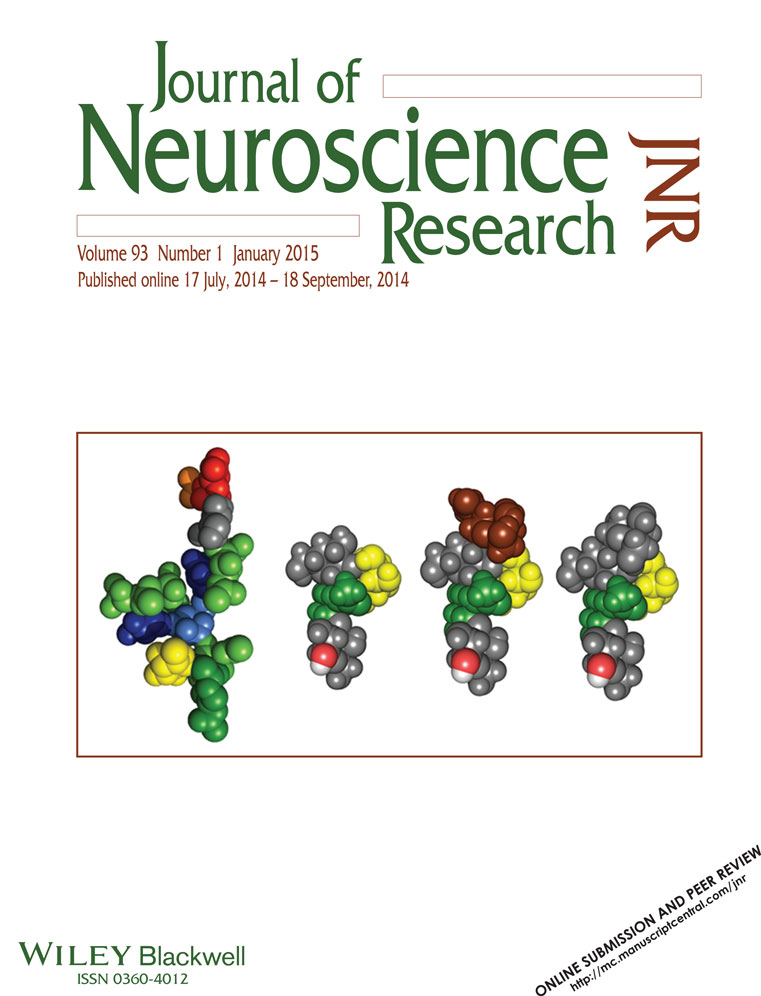
Source: https://onlinelibrary.wiley.com/toc/10974547/93/1
-->
<a href="https://onlinelibrary.wiley.com/toc/10974547/93/1">
  
</a>


PyMOL is especially well suited for:
- preparing publication-quality molecular renderings  
- ray tracing (high-quality shading, reflections, shadows)  
- flexible representation styles (cartoon, surface, sticks, mesh, spheres)  
- highlighting protein–ligand interactions  
- producing high-resolution figures (300–600 DPI)  
- easily saving and re-running scripts to generate identical images  

A major strength of PyMOL is that **every action accessible through the graphical interface can also be executed using typed commands**, such as:
```
fetch 1kap
show cartoon
color red, chain A
ray 3000, 3000
png output.png, dpi=300
```


This allows complete reproducibility and automated image generation — an essential aspect of modern scientific communication.

---

### Alternative Molecular Visualization Software

Several other molecular graphics programs are widely used in teaching and research. Each has strengths and limitations, and some are historically important in the development of molecular visualization:

- **RasMol** — one of the earliest molecular viewers; extremely lightweight but limited in rendering quality.  
- **RasTop** — a graphical front-end to RasMol, more user-friendly but still basic.  
- **Cn3D (NCBI)** — focused on sequence–structure integration; educational and easy to use.  
- **Swiss-PdbViewer (DeepView)** — classic tool for molecular modeling, mutagenesis, and basic graphics.  
- **VMD (Visual Molecular Dynamics)** — extremely powerful for simulations, trajectories, and volumetric data; supports ray tracing via Tachyon.

While these tools remain valuable, PyMOL is generally preferred for:
- reproducible figure pipelines  
- advanced ray-traced illustration  
- scripting  
- fast preparation of publication-level graphics  
- cross-platform support  

Because the goal of this workshop is to teach *effective* and *reproducible* molecular visualization, we will rely primarily on **PyMOL with command-line scripting**.

### 4.2 PyMOL Rendering Workflow
[↑ Back to top](#effective-data-visualization-in-research)

This section demonstrates how to generate a high-quality molecular graphic in PyMOL, starting from a **real biological example**:  
**human hemoglobin in complex with heme and carbon monoxide (PDB: 6KAP)**.

The goal is to show that PyMOL can produce professional-level illustrations quickly, reproducibly, and entirely through command-line scripting.

The workflow combines GUI interactions with explicitly typed commands — essential for reproducibility.

---

## **Step 1 — Load a molecular structure**

Load the structure from the PDB:

```  
fetch 6kap, async=0  
```

Or load from a local file:

```  
load 6kap.pdb  
```

6KAP contains:
- **two protein chains** (A and B)
- **heme cofactors** (residue HEM)
- **CO ligands** (residue CMO)

---

## **Step 2 — Choose a molecular representation**

Publication-ready default:

```  
hide everything  
show cartoon  
set cartoon_smooth_loops, 1  
set cartoon_fancy_helices, 1  
```

Other commonly used representations:
- `cartoon` – proteins
- `sticks` – ligands or key residues
- `surface` – pockets, interfaces
- `spheres` – atoms, ions
- `lines` – minimalistic backbone

Highlight heme groups:

```  
select hemes, resn HEM  
show sticks, hemes  
color hotpink, hemes  
```

Highlight carbon monoxide:

```  
select co, resn CMO  
show spheres, co  
color yellow, co  
```

---

## **Step 3 — Apply meaningful coloring**

### **Color by chain (recommended for hemoglobin)**

```  
color red, chain A  
color blue, chain B  
```

### **Coloring ligands**

```  
color hotpink, resn HEM  
color yellow, resn CMO  
```

### **Secondary structure coloring**

```  
util.cbss()  
```

### **Element-based ligand coloring**

```  
util.cbag hemes  
```

### **Background**

White is journal standard:

```  
bg_color white  
```

---

## **Step 4 — Adjust the camera and viewing angle**

Automatic orientation:

```  
orient  
```

Save a defined camera angle:

```  
get_view  
```

Example PyMOL-generated view matrix:

```  
set_view (\  
     0.298714757,    0.224853694,   -0.927473247,\  
     0.643237948,    0.670481503,    0.369722664,\  
     0.704992652,   -0.707027197,    0.055647239,\  
    -0.000051431,    0.000002850,  -85.109474182,\  
    22.882591248,  -24.646930695,    5.819342613,\  
    49.322834015,  120.891410828,  -20.000000000 )  
```

---

## **Step 5 — Lighting, shading, and aesthetics**

Good lighting dramatically improves figure quality.

### **Basic lighting**

```  
set ambient, 0.3  
set direct, 0.6  
set specular, 0.4  
set shininess, 12  
```

### **Shadows**

```  
set ray_shadows, 1  
set ray_shadow_decay_factor, 0.1  
```

### **Anti-aliasing (mandatory for publication)**

```  
set antialias, 2  
```

### **Ambient occlusion (optional)**

```  
set ray_trace_gain, 0.1  
set ray_opaque_background, off  
```

---

## **Step 5b — Advanced aesthetic tuning (optional)**

### **1. Carbon monoxide (CMO) — matte graphite style**

```  
select co, resn CMO  
show spheres, co  
set sphere_scale, 0.6, co  
color grey40, co  
set specular, 0.1, co  
set shininess, 5, co  
set ambient, 0.5, co  
```

### **2. Heme (HEM) — ball-and-stick with atom-based colors**

```  
select heme, resn HEM  
show sticks, heme  
show spheres, heme  
set stick_radius, 0.15, heme  
set sphere_scale, 0.20, heme  

color black,      heme and elem C  
color lightblue,  heme and elem O  
color violet,     heme and elem N  
color orange,     heme and elem FE  
color orange,     heme and elem P  
```

### **3. Helices: colorful glossy “shell” + grey matte ribbon inside**

PyMOL allows coloring the *two sides* of a cartoon helix separately:
- **outer side** → controlled by standard `color`  
- **inner side** → controlled by `cartoon_highlight_color`

This produces a clean and professional effect without surfaces or duplication.

#### 3a. Inner matte cartoon (helices only)
```
select helices, 6kap and ss H

# Outer color will be set later – this sets INNER surface:
set cartoon_color, forest # if you want to change the color
set cartoon_highlight_color, lightorange

# Matte finish for the inner side
set specular, 0.05, helices
set shininess, 2, helices
set ambient, 0.5, helices
```
#### 3b. Outer glossy surface (colored shell around helices)

``` 

# Glossy finish for the external side
set specular, 1.0, helices
set shininess, 50, helices
set ambient, 0.2, helices 
```

This creates a **visual impression** that:
- the **outer side** is colorful and glossy (surface),  
- the **inner side** (inside the shell) is grey and matte (cartoon helices).

---

## **4. Recommended rendering after aesthetic adjustments**

``` 
set antialias, 2  
set ray_shadows, 1  
set ray_shadow_decay_factor, 0.1  
ray 3500, 3500  
png hemoglobin_6kap_advanced.png, dpi=300  
```


---

## **Step 6 — High-quality ray tracing**

Standard publication-quality:

```  
ray 3000, 3000  
```

Higher resolution (recommended for cropping / multipanel figures):

```  
ray 4000, 4000  
```

Quick preview:

```  
ray 1200, 1200  
```

---

## **Step 7 — Export the final figure**

Save PNG at 300 DPI:

```  
png hemoglobin_6kap.png, dpi=300  
```

Define exact resolution:

```  
png hemoglobin_6kap.png, width=3000, height=3000, dpi=300  
```
[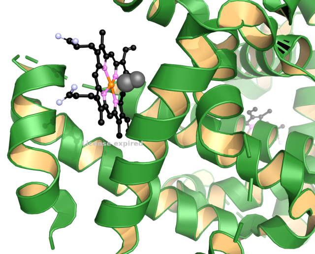](files/hemoglobin_6kap_v2.png)
**Figure:** Example high-quality PyMOL rendering of hemoglobin (6KAP).

Save session:

```  
save 6kap_scene.pse  
```

This workflow demonstrates how to turn a raw PDB file into a refined, publication-ready illustration of **hemoglobin with heme and CO ligands**, including advanced material and lighting effects.

---

## PyMOL Rendering Script
[↑ Back to top](#effective-data-visualization-in-research)


### 4.3 PyMOL Rendering Script — How to Write and Run PyMOL Scripts

PyMOL scripts allow you to automate figure creation and guarantee reproducibility.  
A script is simply a text file containing PyMOL commands executed in sequence.

---

## **1. What is a PyMOL script?**

A PyMOL script is a plain text file with the extension:

```  
.pml  
```

It contains the same commands you would type into the PyMOL command line, for example:

```  
fetch 1crn  
show cartoon  
color cyan, chain A  
ray 2000, 2000  
png figure.png, dpi=300  
```

Running this script always produces the same figure — essential for reproducible research.

---

## **2. How to create a `.pml` script**

1. Open any text editor (Notepad, VSCode, Sublime, nano, etc.)  
2. Paste your PyMOL commands  
3. Save as:

```  
render_myprotein.pml  
```

Make sure the file extension is **.pml**, not .txt.

---

## **3. How to run a script inside PyMOL (GUI)**

Open PyMOL and type:

```  
@render_myprotein.pml  
```

The `@` symbol tells PyMOL to execute the file line by line.

You can also run the script from:  
**File → Run Script…**

---

## **4. Running PyMOL scripts in command-line mode (headless)**

This is ideal for rendering many images automatically or on a remote server (no GUI needed).

Example:

```  
pymol -cq render_myprotein.pml  
```

Meaning:  
- **-c** → no GUI (command-line mode)  
- **-q** → quiet mode  

PyMOL will run the script and save the PNG automatically.


---
<!--================================================================================================================================================================================= -->
---


## **5. Example high-quality rendering script**

File: `render_myprotein.pml`

```  
fetch 1crn  
hide everything  
show cartoon  
set cartoon_smooth_loops, 1  
color cyan, chain A  

# Lighting  
set ambient, 0.3  
set direct, 0.6  
set antialias, 2  
set ray_shadows, 1  

# High-resolution ray trace  
ray 3000, 3000  
png output.png, dpi=300  
```

Run inside PyMOL:

```  
@render_myprotein.pml  
```

Run without GUI:

```  
pymol -cq render_myprotein.pml  
```

---
#### quick run example
Every PyMOL command can be placed in a `.pml` script:
Example script file `render_myprotein.pml`:

```  
fetch 1crn  
hide everything  
show cartoon  
color cyan, chain A  
set ambient, 0.3  
set direct, 0.6  
set antialias, 2  
ray 3000, 3000  
png output.png, dpi=300  
```

Run the script:

```  
@render_myprotein.pml  
```
This ensures that your figure can always be regenerated — essential for transparent and reproducible science.

---

### 4.4 Tips for Publication-Quality Molecular Graphics

High-quality molecular graphics rely on clear design principles, careful control of rendering parameters, and consistent formatting across all figures in a manuscript. The following guidelines summarize best practices derived from structural biology literature and widely accepted visualization standards.

---

## **1. Use clean and simple backgrounds**

A solid **white background** is preferred for most journals.

```  
bg_color white  
```

Avoid gradients or dark backgrounds in publication figures (acceptable for talks but not journals).

---

## **2. Choose representations that match the scientific message**

- **cartoon** → most common for proteins  
- **sticks** → ligands or key residues  
- **surface** → pockets, interfaces  
- **spheres** → metal ions or detailed focuses  
- **mesh** → electron density maps  

Highlight interactions by combining representations:

```  
show cartoon  
show sticks, resn LIG  
```

---

## **3. Use biologically meaningful and consistent colors**

Examples:
- chains: cyan, salmon, light blue, light green  
- ligands: bright colors (yellow, orange)  
- ions: purple (Mg²⁺), orange (Fe³⁺), green (Cl⁻)  

Avoid oversaturated colors.

```  
color salmon, chain A  
color cyan, chain B  
```

Use colorblind-safe palettes when possible.

---

## **4. Improve lighting for professional appearance**

Good lighting increases readability and perceived depth.

Recommended:

```  
set ambient, 0.3  
set direct, 0.6  
set specular, 0.4  
set shininess, 12  
```

Avoid overly dark shadows; adjust decay:

```  
set ray_shadows, 1  
set ray_shadow_decay_factor, 0.1  
```

---

## **5. Always enable antialiasing**

Smooths jagged edges and makes text cleaner:

```  
set antialias, 2  
```

---

## **6. Use high-resolution ray tracing**

Minimum for journals: **300 DPI**  
For complex figures: **4000 px** or more.

```  
ray 3000, 3000  
png figure.png, dpi=300  
```

If cutting out subregions later, render bigger: e.g. 5000–6000 px.

---

## **7. Reduce clutter**

Avoid:
- too many labels  
- overly large atoms  
- unnecessary surfaces  
- grid lines, axes, frames, shadows that obscure the protein  

Emphasize the message, not the software.

Minimalist labeling example:

```  
label resi 45 and name CA, "Arg45"  
set label_size, 18  
```

---

## **8. Carefully orient the protein**

Good orientation improves interpretability:
- backbone slightly tilted  
- binding pockets facing viewer  
- ligand exposed but not cut off  
- avoid top-down “flat” views  

Use `orient` and fine-tune the camera manually:

```  
orient  
```

Store views:

```  
set_view ( … )  
```

---

## **9. Highlight key features**

Examples:
- Binding site residues  
- Allosteric sites  
- Mutations  
- Ligands and cofactors  
- Water molecules in the catalytic pocket  

Selections make this easy:

```  
select pocket, byres (chain A within 4 of resn LIG)  
show sticks, pocket  
```

---

## **10. Maintain consistency across all figures in the manuscript**

Uniform:
- background  
- font size  
- line thickness  
- color palettes  
- rendering settings  
- resolution  

Store a standard script (template), e.g.:

```  
@figure_settings.pml  
```

---

## **11. Use transparency appropriately**

To show ligands inside pockets:

```  
set transparency, 0.3, surface  
```

Do not over-use transparency — it reduces clarity when overdone.

---

## **12. Export vector overlays when needed**

For hybrid figures (vector text + raster protein):

1. Export transparent PNG from PyMOL  
2. Combine labels/panels in Inkscape or Illustrator

This preserves the quality of the molecular rendering while keeping text as vector graphics.

---

## **13. Check final files at 100% and 300% zoom**

Ensures no:
- pixelation  
- jagged edges  
- inconsistent lighting  
- mislabeled residues  
- truncated atoms  

Many mistakes are only visible at high zoom.

---

## **14. Recommended rendering presets**

You can define custom presets to maintain consistency.

Example preset file `hq_settings.pml`:

```  
set antialias, 2  
set ambient, 0.3  
set direct, 0.6  
set ray_shadows, 1  
set ray_shadow_decay_factor, 0.1  
set specular, 0.4  
set shininess, 12  
```

Load once per session:

```  
@hq_settings.pml  
```

---

These guidelines will help you produce clear, consistent, and professional molecular figures suitable for scientific journals and presentations.

---

### 4.5 Common Mistakes in Molecular Graphics (and How to Fix Them)

Even small errors in molecular visualization can significantly reduce clarity, distort interpretation, or make a figure look unprofessional. This section provides a practical overview of the most frequent mistakes made by beginners — and how to correct them using simple PyMOL techniques.

---

## **1. Jagged edges (poor smoothing)**

**Cause:**  
Ray tracing or screenshots made without antialiasing.

**Fix:**  
Enable antialiasing for smooth edges.

```  
set antialias, 2  
```

---

## **2. Overly dark or unrealistic shadows**

**Cause:**  
Default shadow settings or harsh lighting.

**Fix:**  
Reduce shadow strength; add ambient light.

```  
set ray_shadows, 1  
set ray_shadow_decay_factor, 0.1  
set ambient, 0.3  
set direct, 0.6  
```

---

## **3. Colors too saturated or inconsistent**

**Cause:**  
Random colors assigned to chains or residues.

**Fix:**  
Use biological, muted color palettes.

```  
color cyan, chain A  
color salmon, chain B  
```

Avoid neon green, bright magenta, intense red — they distract and do not reproduce well in print.

---

## **4. Ligands not visible / lost in protein surface**

**Cause:**  
Surface hides ligand; poor orientation.

**Fix:**  
Expose ligand with sticks and transparent surface.

```  
show sticks, resn LIG  
set transparency, 0.3, surface  
```

---

## **5. Flat, low-contrast images**

**Cause:**  
Weak lighting, no occlusion, poor depth cues.

**Fix:**  
Add specular light, adjust shininess, use moderate shadows.

```  
set specular, 0.4  
set shininess, 12  
set ambient, 0.25  
```

---

## **6. Misaligned orientation / poor camera view**

**Cause:**  
Random camera angle; protein appears flat.

**Fix:**  
Use `orient` + manual fine tuning.

```  
orient  
```

Then rotate slightly to show depth and binding pocket layout.

---

## **7. Labels too large or too small**

**Cause:**  
Default label size rarely fits publication standards.

**Fix:**  
Use consistent label size and minimal number of labels.

```  
set label_size, 18  
label resi 45 and name CA, "Arg45"  
```

Do not label everything — emphasize only essential residues.

---

## **8. Using screenshots instead of ray tracing**

**Cause:**  
Students often use the “Screenshot” button.

**Fix:**  
Use ray tracing for professional-quality figures.

```  
ray 3000, 3000  
png figure.png, dpi=300  
```

Screenshots should be used only for quick previews.

---

## **9. Pixelated figures due to small render size**

**Cause:**  
Rendering at low resolution (e.g., 800×600 px).

**Fix:**  
Always render at **3000 px or more** for journal figures.

```  
ray 4000, 4000  
png figure.png, dpi=300  
```

---

## **10. Too much transparency**

**Cause:**  
Overusing transparency makes figures “foggy” and unclear.

**Fix:**  
Use transparency sparingly (0.2–0.4).

```  
set transparency, 0.3, surface  
```

Overuse destroys contrast and makes the structure hard to read.

---

## **11. Protein surface too glossy or plasticky**

**Cause:**  
Excessive specular reflections and shininess.

**Fix:**  
Tone down specular highlights.

```  
set specular, 0.2  
set shininess, 8  
```

---

## **12. Mixing background colors across figures**

Consistency matters. Different backgrounds across panels look unprofessional.

**Fix:**  
Use **white** for papers, **dark** for presentations.

```  
bg_color white  
```

---

## **13. Unnecessary or distracting elements**

Examples:
- axes  
- default grid  
- bounding box  
- labels on every residue  
- too many surfaces  

**Fix:**  
Remove all unnecessary GUI elements.

```  
set axes, off  
set dash_gap, 0  
```

---

## **14. Failing to document visualization settings**

**Cause:**  
Manual clicking in GUI produces non-reproducible images.

**Fix:**  
Always use PyMOL commands or scripts.

```  
@figure_settings.pml  
```

---
These guidelines help avoid the most common pitfalls in molecular visualization and ensure that your figures meet the standards of high-impact scientific publications.
---

### 4.6 Example: From Raw PDB to Final Publication-Quality Figure

This example demonstrates the complete process of transforming a raw PDB file into a clean, high-quality, publication-ready molecular graphic using PyMOL.  
Every step includes explicit commands to ensure reproducibility.

We will use the classical Crambin structure (PDB ID: **1CRN**) for demonstration.

---

## **Step 1 — Start with a raw PDB structure**

Load a structure directly from the Protein Data Bank:

```  
fetch 1crn, async=0  
```

Initially, the protein appears with:
- all atoms visible  
- default coloring  
- black background  
- no smoothing or clarity enhancements  

This is the “raw state” from which we start.

---

## **Step 2 — Clean the view and choose representations**

1. Hide everything  
2. Enable cartoon representation  
3. Use smooth loops and fancy helices  
4. Set a clean white background

```  
hide everything  
show cartoon  
set cartoon_smooth_loops, 1  
set cartoon_fancy_helices, 1  
bg_color white  
```

Color the protein by chain (crystallographic chains, if present):

```  
color lightblue, chain A  
```

If a ligand exists, highlight it:

```  
select ligand, organic  
show sticks, ligand  
color yellow, ligand  
```

---

## **Step 3 — Improve lighting and shading**

To achieve professional aesthetic quality, adjust lighting parameters:

```  
set ambient, 0.3  
set direct, 0.6  
set specular, 0.4  
set shininess, 12  
```

Add soft shadows for depth:

```  
set ray_shadows, 1  
set ray_shadow_decay_factor, 0.1  
```

Enable antialiasing (mandatory for print):

```  
set antialias, 2  
```

Optional: ambient occlusion (makes pockets and grooves more visible)

```  
set ray_trace_gain, 0.1  
set ray_opaque_background, off  
```

---

## **Step 4 — Adjust orientation for clarity**

Automatically orient the molecule:

```  
orient  
```

Fine-tune rotation manually using the mouse.

Store the final camera view:

```  
get_view  
```

You can copy/paste the resulting view matrix for perfect reproducibility in future renders.

---

## **Step 5 — Ray trace at publication resolution**

Minimum for journals: **300 DPI**  
Recommended width: **3000–4000 px**  
High-end: **5000+ px** for cropping and multipanel figures

High-resolution render:

```  
ray 3000, 3000  
```

For even better detail:

```  
ray 4000, 4000  
```

---

## **Step 6 — Export the final figure**

Save as PNG with 300 DPI:

```  
png crambin_final.png, dpi=300  
```

Save the PyMOL session (optional, recommended):

```  
save crambin_final.pse  
```

This allows re-rendering or editing later.

---

## **Step 7 — (Optional) Automate the entire process**

Create a script `crambin_render.pml`:

```  
fetch 1crn  
hide everything  
show cartoon  
set cartoon_smooth_loops, 1  
bg_color white  
color lightblue, chain A  
set ambient, 0.3  
set direct, 0.6  
set antialias, 2  
ray 3000, 3000  
png crambin.png, dpi=300  
```

Run it:

```  
@crambin_render.pml  
```

This produces the same final image *every single time* — ensuring strict reproducibility.

---

## **Result**

You now have a publication-quality molecular figure with:
- smooth cartoon representation  
- clean white background  
- biologically meaningful colors  
- enhanced lighting and shading  
- ray-traced global illumination  
- high resolution for journals  
- fully reproducible script  

This workflow mirrors best practices used in structural biology, drug design, and high-impact journals.


---
<!--================================================================================================================================================================================= -->
---


## **6. Why scripting matters**

- **Reproducibility** — regenerate figures any time  
- **Consistency** — all images share identical settings  
- **Automation** — render dozens of variants without clicking  
- **Portability** — scripts run on Windows, macOS, Linux  
- **Version control** — store scripts in GitHub with your project  

---

This completes the PyMOL scripting tutorial and provides a reproducible workflow for generating publication-quality molecular graphics.

sources:
- https://pymol.org/dokuwiki/
- https://wiki.pymol.org/
- https://mooerslab.github.io/pymolsnips/
- https://www.youtube.com/playlist?list=PLUMhYZpMLtal_Z7to3by2ATHP-cI4ma5X


---

# 5. Software Ecosystem for Scientific Figure Preparation
[↑ Back to top](#effective-data-visualization-in-research)


> ⚠️ **IMPORTANT NOTE — PLEASE READ**  
> The tools listed below represent **only a small subset** of the full software ecosystem available for bioinformatics, structural biology, data analysis, and figure preparation.  
> There are **many, many more programs** widely used in research.  
> The overview here is **intentionally simplified** for the purposes of this workshop and focuses on commonly used, broadly accessible tools.

Scientific figure creation typically involves three distinct stages:  
1) processing biological data and generating exploratory visualizations,  
2) performing statistical analysis and creating analytical plots,  
3) assembling final publication-ready graphics.

Below is a structured overview of tools commonly used in modern scientific visualization, organized into **three functional levels**.

---

## **5.1 Level 1 — Tools for Processing and Visualizing Biological Data**

These tools are used to inspect biological structures, genomic sequences, alignments, phylogenies, metagenomic profiles, annotations, and pathways.  
They typically generate **exploratory or diagnostic visualizations**, not final journal figures.

### **A. Genome Browsers**
- **IGV (Integrative Genomics Viewer)** — BAM, VCF, GFF, BED; essential for NGS workflows.  
- **UCSC Genome Browser** — rich annotation layers and comparative genomics.  
- **Ensembl Genome Browser** — integrated orthology, synteny, and high-quality gene models.  
- **Geneious (commercial)** — multi-purpose analysis and visualization suite.

### **B. Sequence & Alignment Viewers**
- **BioEdit** — classical sequence editor.  
- **JalView** — advanced alignment viewer with PCA, annotation tracks, trees.  
- **UGene** — graphical platform for MSA and motif search.  
- **MEGA** — alignments + phylogenetic inference.

### **C. Molecular Structure Visualization**
- **PyMOL** — publication-quality molecular graphics (ray tracing, scripting).  
- **UCSF Chimera / ChimeraX** — excellent for EM maps, surfaces, volumetric data.  
- **VMD** — molecular dynamics trajectories and volumetric data.  
- **RasMol / RasTop** — lightweight, educational tools.  
- **Swiss-PdbViewer (DeepView)** — structural modeling and mutagenesis workflows.

### **D. Functional Annotation, Networks, and Pathways**
- **STRING** — protein interaction networks.  
- **KEGG Mapper** — metabolic pathway annotation.  
- **g:Profiler** — GO enrichment and functional annotation.  
- **DAVID** — functional clustering.  
- **BLAST** — local/global sequence similarity searches.  
- **InterPro / Pfam** — domain architectures.

### **E. Metagenomics Tools**
- **QIIME2** — standard ecosystem for metagenomic diversity and taxonomy.  
- **MetaPhlAn** — marker-gene-based community profiling.  
- **Kraken2 / Bracken** — fast taxonomic classification of reads.

### **F. NGS Processing Tools**
- **FastQC** — sequencing quality control  
- **Trimmomatic / fastp** — trimming  
- **BWA, Bowtie2, STAR** — alignment  
- **samtools / bcftools** — variant and alignment processing  
- **featureCounts / HTSeq** — quantification  
- **DESeq2 / EdgeR** — differential expression  

---

### **G. Specialized Visualization Tools (Python / Perl / Standalone)**

These tools generate **complex biological visualizations** such as genomic relationships, synteny maps, circular plots, multi-layer genomic representations, or high-dimensional biological networks.

#### **Circos**
- One of the most iconic visualization frameworks in genomics  
- Creates circular genome plots (chromosomes, synteny, links, heatmaps, ribbons)  
- Ideal for:  
  - genome comparisons  
  - synteny and rearrangements  
  - multi-layer annotation tracks  
  - interaction maps  
  - evolutionary genomics  
- Originally Perl-based; now also available through **Python wrappers** and **web tools**  
- Extremely powerful but requires configuration files  
- Used in many high-impact publications (Nature, Science, Cell)

Other tools in this category:

#### **UpSetR / UpSetPlot**
- Visualization of complex set intersections  
- Alternative to Venn diagrams for multi-set relationships

#### **HiCExplorer / Juicebox**
- Chromatin conformation maps (Hi-C)  
- Multi-resolution interaction heatmaps

#### **SUSHI / pyGenomeTracks**
- Multi-track genomic figure generation (ChIP-seq, RNA-seq, ATAC-seq)

**Role of this category:**  
👉 These tools create **specialized high-dimensional biological visualizations** that cannot be generated by typical plotting libraries.

---

## **5.2 Level 2 — Statistical Analysis and Plotting Tools**

These tools generate **analytical plots, tables, statistical summaries**, and exploratory graphs.

### **R + ggplot2 (tidyverse)**
- Reproducible scientific visualization standard  
- Vector export capabilities (PDF, SVG)  
- Extensive theming, labeling, multi-panel support

### **Python (matplotlib, seaborn, plotly, bokeh)**
- Highly flexible plotting ecosystem  
- Matplotlib → classical scientific plots  
- Seaborn → statistical visualizations  
- Plotly/Bokeh → interactive graphics

### **Excel**
- Quick exploratory tool  
- Limited aesthetics; often not suitable for publications

### **Statistica, SPSS, JMP**
- GUI-focused statistical platforms  
- Produce analysis-driven plots

### **GraphPad Prism**
- Widely used in biomedical sciences  
- Simple statistical tests + clean plots  
- Good for quick figures; limited layout control

---

## **5.3 Level 3 — Tools for Final Publication-Ready Figures**

These tools handle:
- multi-panel composition  
- typography and annotations  
- vector layering  
- DPI settings, color space (RGB/CMYK), and journal requirements  
- export to PDF, TIFF, or EPS

### **Vector Editors (for final figure assembly)**

#### **Inkscape**
- Free, open-source  
- Ideal for composite figures, labels, arrows, vector text  
- Works perfectly with PyMOL PNG + ggplot PDF

#### **Adobe Illustrator**
- Industry standard for final figure production  
- Preferred by many high-impact journals  
- Advanced vector and typography control

#### **CorelDRAW**
- Strong CMYK workflows  
- Good PDF/X export support  
- Common in Europe

#### **Affinity Designer**
- Affordable, professional-grade alternative  
- Clean UI and powerful vector tools

---

### **Raster Editors**

#### **IrfanView**
- Extremely fast and lightweight  
- Ideal for resizing, cropping, DPI adjustments, TIFF export  
- Perfect for meeting technical journal specifications

#### **GIMP**
- Free alternative to Photoshop  
- Layers, masks, color correction

#### **Photoshop**
- Professional raster editor  
- 16-bit depth, CMYK workflows  
- Standard in imaging-heavy disciplines

#### **ImageMagick**
- Command-line automation for batch processing  
- Useful in reproducible pipelines

---

### **Presentation & Drafting Tools**

#### **PowerPoint**
- Effective for assembling drafts and multi-panel arrangements  
- Export as PDF or high-res PNG

#### **Keynote / Google Slides**
- Good for collaborative drafts  
- Not recommended for final journal-grade figures

---

## **Summary: Roles of the Three-Level Ecosystem**

| Level | Purpose | Examples |
|-------|---------|----------|
| **1. Biological Data Tools** | Explore sequences, structures, alignments, pathways, NGS data | IGV, JalView, PyMOL, ChimeraX, KEGG, QIIME2, Circos, pyGenomeTracks |
| **2. Statistical & Plotting Tools** | Analysis, tables, exploratory & analytical plots | R/ggplot2, Python, Excel, Prism |
| **3. Publication-Quality Graphics Tools** | Final layout, typography, DPI control, export | Inkscape, Illustrator, Corel, IrfanView, GIMP |

Together, these three layers represent a complete and flexible ecosystem spanning the full workflow from raw biological data to submission-ready scientific figures.


---
<!--================================================================================================================================================================================= -->
---


# 6. Data Visualization in R
[↑ Back to top](#effective-data-visualization-in-research)

This chapter introduces practical data visualization techniques in R, using a synthetic ecological dataset created specifically for this workshop. All examples—including base R plots, ggplot2 graphics, multi-dimensional visualizations, and exporting publication-quality figures—use the same dataset to ensure consistency and reproducibility.

The goal is to demonstrate:
- how to load, explore, and visualize data,
- how to generate clean, clear, and informative scientific graphics,
- how to prepare publication-ready figures that follow journal standards.

---

## 6.1 Input Files and Dataset Overview
[↑ Back to top](#effective-data-visualization-in-research)

The following files are required for reproducing all analyses in this chapter.  
They are available in the `files/` directory of this repository.

### **1. `EDVis_Kaamos_SyntEcoDataset.R`**
R script that generates the synthetic ecological dataset used throughout this chapter.  
It defines all categorical and numerical variables, introduces biologically meaningful patterns, and exports the final table as a CSV file.

### **2. `EDVis_Kaamos_Rscript.R`**
A standalone script containing all R commands covered in this workshop:
- loading the dataset,  
- performing exploratory visualizations,  
- generating ggplot2 charts,  
- exporting high-quality graphics,  
- statistical comparisons (e.g., ANOVA),  
- PCA and multi-dimensional plotting.

Participants can run this file line-by-line during or after the workshop.

### **3. `eco_measurements.csv`**
The main input dataset for all examples.  
A synthetic ecological dataset with **1080 rows and 16 columns**, representing measurements collected across different sites, habitat types, species, and biological replicates.

### **4. `eco_measurements.xlsx`**
Spreadsheet version of the dataset—for inspection, validation, or manual exploration outside R.

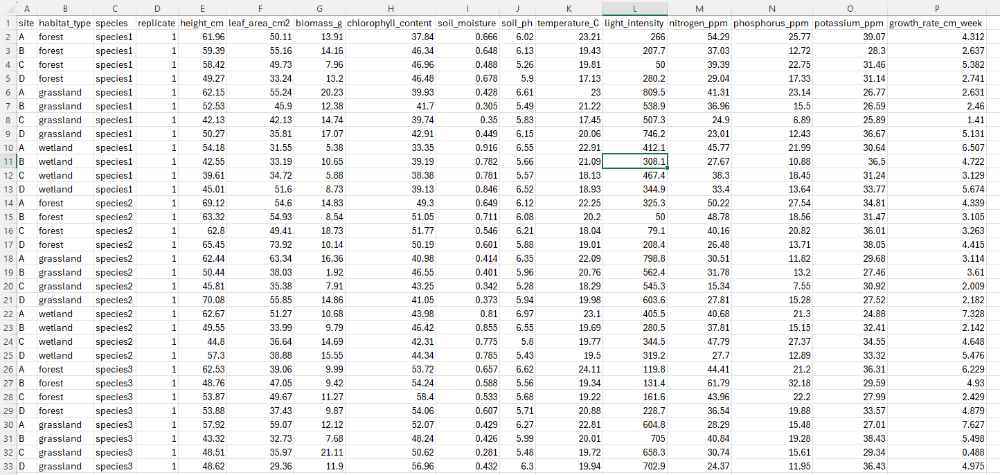

---

## 6.1.1 Dataset Description — Column-by-Column Explanation
The dataset contains four categorical variables describing sampling conditions and twelve numeric variables representing biological measurements and environmental factors.  
It is designed to be:
- ecologically coherent,
- statistically structured,
- suitable for PCA clustering,
- appropriate for multi-dimensional visualization.

### **Categorical Variables (4)**

#### **`site`**
Sampling location: **A**, **B**, **C**, **D**.  
Defines broad environmental differences such as nutrient levels and temperature.

#### **`habitat_type`**
Ecological habitat category:  
- `forest`,  
- `grassland`,  
- `wetland`.  
This variable introduces the strongest separation in PCA.

#### **`species`**
Three plant species:  
- `species1`,  
- `species2`,  
- `species3`.

#### **`replicate`**
Biological replicate (1–5).  
Demonstrates within-group biological variability.

---

### **Numeric Variables (12)**

#### **`height_cm`**
Plant height (cm).  
Approximately normal distribution with site × habitat × species effects.

#### **`leaf_area_cm2`**
Correlated with height. Ideal for scatterplots and linear regression examples.

#### **`biomass_g`**
Above-ground biomass (g).  
Nonlinear function of height plus error.

#### **`chlorophyll_content`**
Chlorophyll content (SPAD units).  
Species- and habitat-dependent; good for ANOVA and grouping.

#### **`soil_moisture`**
Strongly driven by habitat (wetland > forest > grassland).  
One of the key PCA-driving variables.

#### **`soil_ph`**
Soil pH (4.5–7.5).  
Moderately site-dependent.

#### **`temperature_C`**
Air temperature during sampling.  
Distinct means for each site.

#### **`light_intensity`**
Light intensity (μmol/m²/s).  
Habitat-driven (grassland highest, forest lowest).

#### **`nitrogen_ppm`**
Soil nitrogen content (ppm).  
Site × habitat effect.

#### **`phosphorus_ppm`**
Moderately correlated with nitrogen.  
Useful for correlation plots.

#### **`potassium_ppm`**
Mostly random with mild habitat influence.  
Good for histograms.

#### **`growth_rate_cm_week`**
Weekly growth rate.  
Derived from height and soil moisture with random variation.

---

## 6.1.2 Summary of Dataset Properties
- **1080 observations**
- **16 variables** (4 categorical + 12 numeric)
- Includes:
  - group differences suitable for ANOVA  
  - linear and nonlinear relationships  
  - clear PCA clustering  
  - multiple dimensions for scatterplots (color, shape, size, facets, labels)

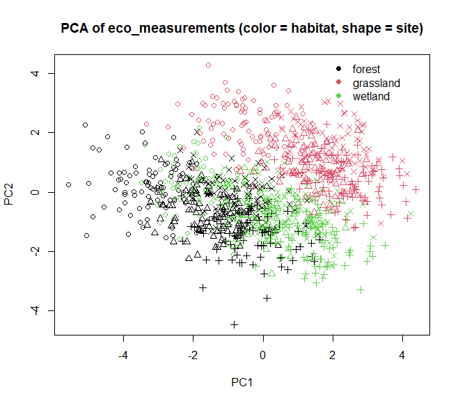


This dataset provides excellent flexibility for teaching scientific visualization.

---


# 6.2 Base R Plots
[↑ Back to top](#effective-data-visualization-in-research)

In this section we use **base R graphics** to explore the `eco_measurements` dataset.  
All plots are generated directly from `eco_measurements.csv` using simple R commands such as `hist()`, `boxplot()`, and `plot()`.

Below you will find:
- short explanations of what each plot shows,  
- R code to generate the figure and save it as a PNG file (using `png()`),  
- Markdown references to the resulting image files with suggested filenames and captions.

> **Note:** All examples assume that the file `files/eco_measurements.csv` is present and that the working directory is set to the root of the repository.

---

## 6.2.1 Loading the dataset

The following code loads the dataset and ensures that categorical variables are treated as factors.

```  
eco <- read.csv("files/eco_measurements.csv", stringsAsFactors = FALSE)

eco$site         <- factor(eco$site)
eco$habitat_type <- factor(eco$habitat_type)
eco$species      <- factor(eco$species)
eco$replicate    <- factor(eco$replicate)

str(eco)
```

---

## 6.2.2 Histogram of plant height

This plot shows the **distribution of plant height** (`height_cm`) across all sites, habitats, and species.  
It is useful to check whether the data follow an approximately normal distribution and to detect potential outliers or skewness.

### R code to generate the figure (PNG)

```  
# png("files/fig6_2_1_height_hist.png", width = 1600, height = 1200, res = 300)

hist(
  eco$height_cm,
  breaks = 30,
  main   = "Distribution of plant height",
  xlab   = "Height (cm)",
  col    = "grey80",
  border = "white"
)

# dev.off()
```

### Markdown for the figure

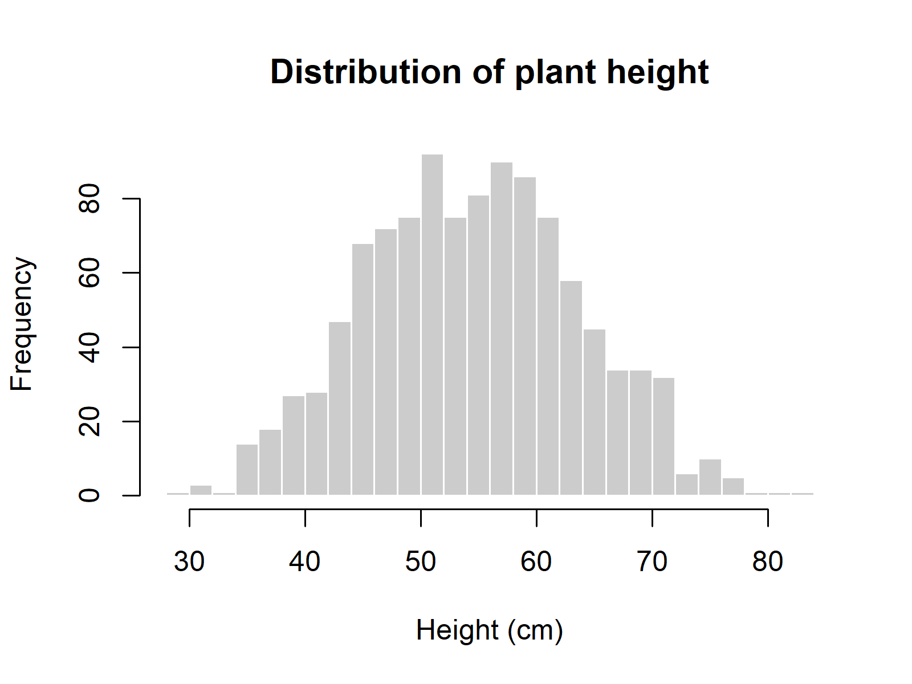  

**Figure 6.2.1.** Histogram of plant height (`height_cm`) for all observations in the `eco_measurements` dataset. The distribution is approximately normal with moderate spread, reflecting variation across sites, habitats, and species.

---

## 6.2.3 Boxplot of height by site

This plot compares **plant height between sites** (`site`: A, B, C, D).  
It is designed to show site-specific differences in height, which can be later tested statistically (e.g., ANOVA).

### R code to generate the figure (PNG)

```  
# png("files/fig6_2_2_height_by_site.png", width = 1600, height = 1200, res = 300)

boxplot(
  height_cm ~ site,
  data  = eco,
  main  = "Plant height by site",
  xlab  = "Site",
  ylab  = "Height (cm)",
  col   = c("lightblue", "lightgreen", "lightpink", "lightyellow")
)

# dev.off()
```

### Markdown for the figure

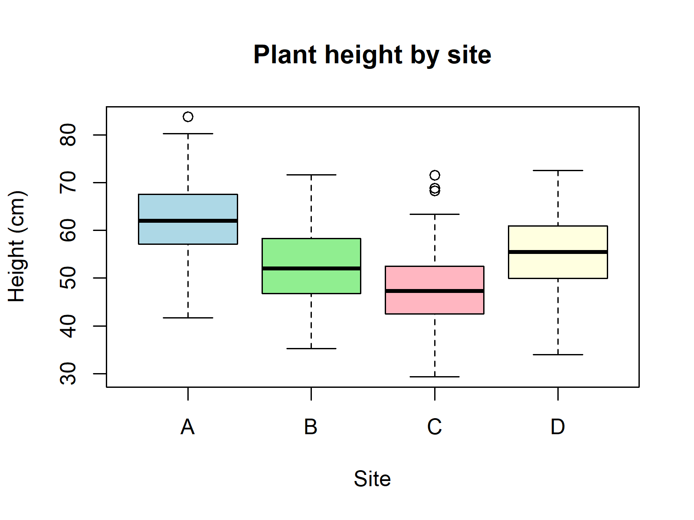  

**Figure 6.2.2.** Boxplot of plant height (`height_cm`) grouped by site (`site`). Median height and overall distribution differ between sites, reflecting systematic environmental differences built into the synthetic dataset.

---

## 6.2.4 Boxplot of chlorophyll content by habitat type

This plot shows how **chlorophyll content** (`chlorophyll_content`) varies between habitat types (`habitat_type`: forest, grassland, wetland).  
It illustrates habitat-level differences in physiological status of the plants.

### R code to generate the figure (PNG)

```  
# png("files/fig6_2_3_chl_by_habitat.png", width = 1600, height = 1200, res = 300)

boxplot(
  chlorophyll_content ~ habitat_type,
  data  = eco,
  main  = "Chlorophyll content by habitat type",
  xlab  = "Habitat type",
  ylab  = "Chlorophyll content (SPAD units)",
  col   = c("darkolivegreen3", "goldenrod1", "skyblue2")
)

# dev.off()
```

### Markdown for the figure

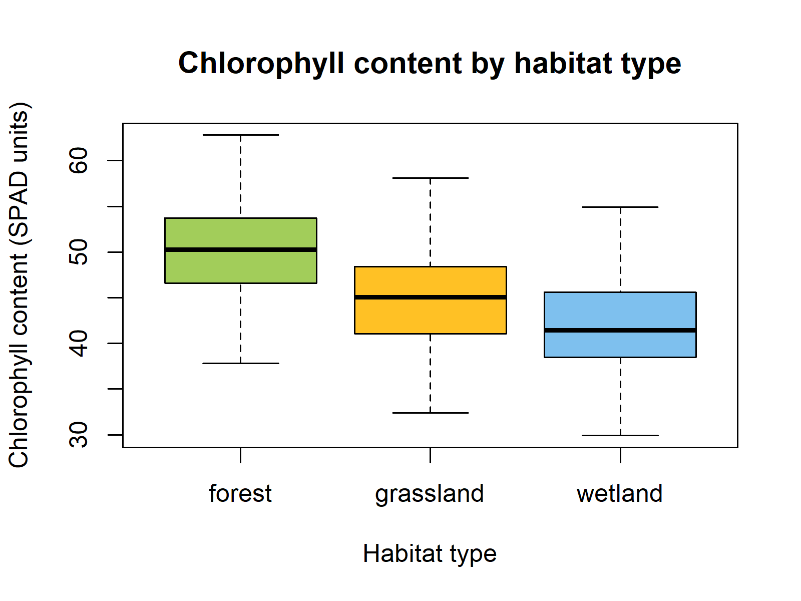  

**Figure 6.2.3.** Boxplot of chlorophyll content (`chlorophyll_content`) grouped by habitat type (`habitat_type`). Forest, grassland, and wetland show distinct distributions, reflecting different light and nutrient conditions encoded in the dataset.

---

## 6.2.5 Scatterplot of height vs leaf area

This plot visualizes the relationship between **plant height** (`height_cm`) and **leaf area** (`leaf_area_cm2`).  
Points are colored by `site` to illustrate how the relationship may vary across locations.

### R code to generate the figure (PNG)

```  
# Define a simple color palette for sites
site_cols <- c(A = "red", B = "blue", C = "darkgreen", D = "purple")

# png("files/fig6_2_4_height_vs_leafarea.png", width = 1600, height = 1200, res = 300)

plot(
  eco$height_cm,
  eco$leaf_area_cm2,
  col  = site_cols[eco$site],
  pch  = 16,
  main = "Height vs leaf area (colored by site)",
  xlab = "Height (cm)",
  ylab = "Leaf area (cm²)"
)

legend(
  "topleft",
  legend = levels(eco$site),
  col    = site_cols[levels(eco$site)],
  pch    = 16,
  bty    = "n",
  title  = "Site"
)

# dev.off()
```

### Markdown for the figure

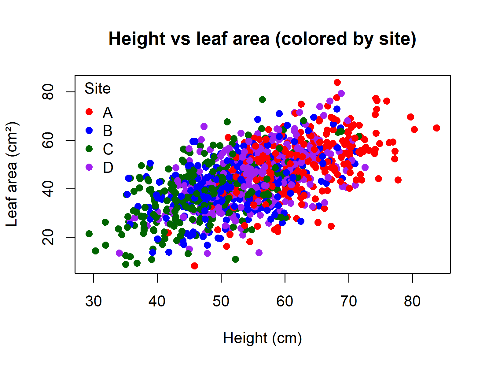  

**Figure 6.2.4.** Scatterplot of plant height (`height_cm`) vs leaf area (`leaf_area_cm2`). Each point represents one individual. Colors denote sites (`site`), illustrating both the overall positive relationship between height and leaf area and site-specific patterns.

---

## 6.2.6 Scatterplot of soil nitrogen vs phosphorus

This plot shows the relationship between **nitrogen** (`nitrogen_ppm`) and **phosphorus** (`phosphorus_ppm`) in the soil.  
Points are colored by habitat type and shaped by site, demonstrating how multiple categorical variables can be encoded in a base R scatterplot.

### R code to generate the figure (PNG)

```  
# Colors for habitat types
hab_cols <- c(forest = "darkolivegreen4",
              grassland = "goldenrod3",
              wetland = "steelblue3")

# Shapes for sites
site_pch <- c(A = 16, B = 17, C = 15, D = 18)

# png("files/fig6_2_5_nitrogen_vs_phosphorus.png", width = 1600, height = 1200, res = 300)

plot(
  eco$nitrogen_ppm,
  eco$phosphorus_ppm,
  col  = hab_cols[eco$habitat_type],
  pch  = site_pch[eco$site],
  main = "Soil nitrogen vs phosphorus",
  xlab = "Nitrogen (ppm)",
  ylab = "Phosphorus (ppm)"
)

legend(
  "topleft",
  legend = levels(eco$habitat_type),
  col    = hab_cols[levels(eco$habitat_type)],
  pch    = 16,
  bty    = "n",
  title  = "Habitat type"
)

legend(
  "bottomright",
  legend = levels(eco$site),
  pch    = site_pch[levels(eco$site)],
  bty    = "n",
  title  = "Site"
)

# dev.off()
```

### Markdown for the figure

  

**Figure 6.2.5.** Scatterplot of soil nitrogen (`nitrogen_ppm`) vs phosphorus (`phosphorus_ppm`). Colors represent habitat type (`habitat_type`), and point shapes represent sites (`site`). The moderate positive association between nitrogen and phosphorus is visible, with habitat- and site-specific clustering.

---

## 6.2.6 Pairwise relationships between selected variables

To obtain a quick overview of **pairwise relationships** between several numeric variables, we can use `pairs()` on a subset of columns (e.g., height, biomass, soil moisture, light intensity).

### R code to generate the figure (PNG)

```  
vars_for_pairs <- c("height_cm", "biomass_g", "soil_moisture", "light_intensity")

# png("files/fig6_2_6_pairs_selected_numeric.png", width = 2000, height = 2000, res = 300)

pairs(
  eco[, vars_for_pairs],
  main = "Pairwise relationships between selected variables"
)

# dev.off()
```

### Markdown for the figure

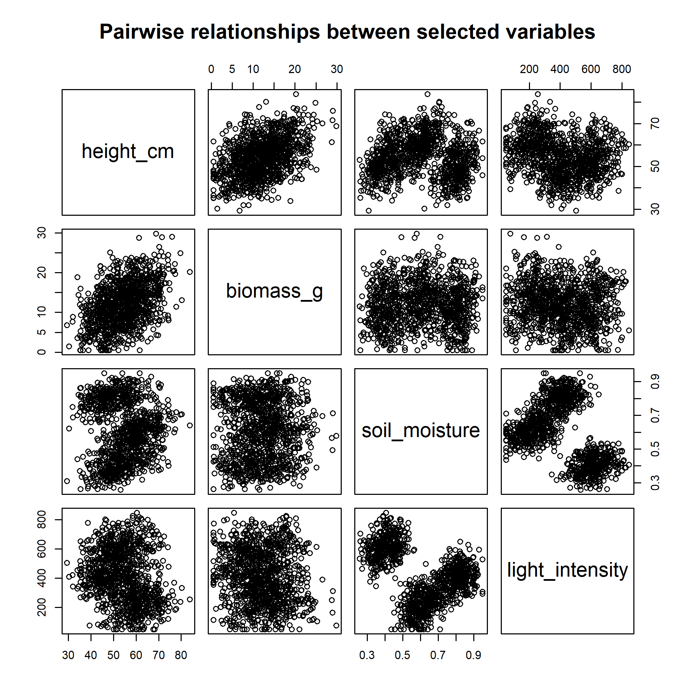  

**Figure 6.2.6.** Pairwise scatterplot matrix (`pairs()`) for a subset of numeric variables (`height_cm`, `biomass_g`, `soil_moisture`, `light_intensity`). This overview helps identify correlations, nonlinear patterns, and potential outliers before more advanced modeling.


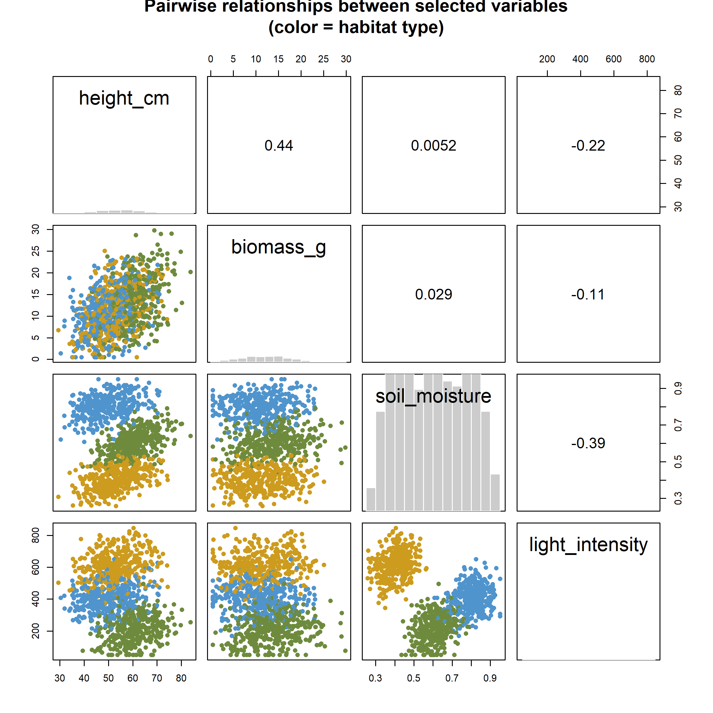

**Figure 6.2.6.** Pairwise plot matrix for four numeric variables  
(`height_cm`, `biomass_g`, `soil_moisture`, `light_intensity`).  
Diagonal panels show histograms, upper panels show Pearson correlations, and lower panels show colored scatterplots.  
Colors represent habitat type.


---

# 6.3 Graphic Devices in R (PNG, TIFF, PDF, SVG)
[↑ Back to top](#effective-data-visualization-in-research)

R uses a system of **graphic devices** to control how figures are displayed, stored, or exported.  
A graphic device is simply a “drawing surface” — it can be your computer screen or a file on disk.

Understanding graphic devices is essential for creating **publication-ready figures**, especially when journals require specific file formats, dimensions, and DPI.

---

## 6.3.1 What is a graphic device in R?

A *graphic device* determines:
- **where** the graphic is drawn (screen, PNG file, PDF file…)
- **how** it is encoded (raster, vector)
- **what parameters** it uses (resolution, width, height, color model)

In R, opening a device looks like this:

```  
png("figure.png")     # open a PNG device  
plot(x, y)            # draw on it  
dev.off()             # close the device  
```

Nothing is saved until you call **`dev.off()`**.

---

## 6.3.2 Raster vs Vector Graphics

Before choosing a device, you need to know the difference between raster and vector formats.

### **Raster (pixel-based)**  
Formats: **PNG, TIFF, JPG**  
- consist of individual pixels  
- resolution-dependent  
- excellent for: photos, heatmaps, surfaces, ray-traced PyMOL renders  
- poor for scaling (can become blurry)

### **Vector (geometry-based)**  
Formats: **PDF, SVG**  
- consist of lines, shapes, and text  
- infinitely scalable  
- excellent for: scatterplots, boxplots, line plots, ggplot2 figures  
- poor for large raster layers (e.g., images embedded inside plots)

---

## 6.3.3 DPI: Dots Per Inch

Journals usually require:

- **300 DPI** for standard figures  
- **600 DPI** for line art  
- **1200 DPI** for bitmap line art (rare)

Raster devices (PNG, TIFF) allow you to specify DPI:

```  
png("figure.png", width = 2000, height = 1500, res = 300)
```

Vector formats **do not have DPI**, because they scale infinitely.

---

## 6.3.4 Dimensions: Inches, cm, mm

R uses **inches** internally for device sizes.

To convert:
- 1 inch = 2.54 cm  
- 1 cm = 0.3937 inch  
- 1 mm = 0.03937 inch  

If a journal asks for a figure **7 inches wide**, you can specify:


```  
png("figure.png", width = 7, height = 5, units = "in", res = 300)
```

This ensures consistent physical size in the final publication.

---

## 6.3.5 PNG — Best for screens, presentations, GitHub, and web

PNG is a widely supported raster format.  
Use it for:
- quick exploratory graphics  
- figures inserted into README files  
- any screen-based visualization

### Example export


```  
png("fig_example_png.png", width = 2000, height = 1600, res = 300)
plot(eco$height_cm, eco$leaf_area_cm2,
     main = "Height vs Leaf Area",
     xlab = "Height (cm)", ylab = "Leaf Area (cm²)")
dev.off()
```

---

## 6.3.6 TIFF — Required by many journals

TIFF is the **most common submission format** for scientific journals.  
Supports **LZW compression**, which preserves quality and reduces file size.

### Example (TIFF with LZW compression)


```  
tiff("fig_example_tiff.tiff",
     width = 2000, height = 1600,
     res = 300, compression = "lzw")

boxplot(height_cm ~ site, data = eco,
        main = "Plant Height by Site",
        xlab = "Site", ylab = "Height (cm)")

dev.off()
```

TIFF is ideal for:
- high-quality raster export  
- microscopy images  
- PyMOL ray-traced renders  
- figures combining raster + annotations

---

## 6.3.7 PDF — Best for vector scientific figures

PDF is **vector-based**, so it is excellent for:
- ggplot2 figures  
- line plots, boxplots, scatterplots  
- figures that need perfect scaling

### Example export


```  
pdf("fig_example_pdf.pdf", width = 7, height = 5)
plot(eco$soil_moisture, eco$light_intensity,
     main = "Soil Moisture vs Light Intensity",
     xlab = "Soil Moisture", ylab = "Light Intensity")
dev.off()
```

PDF files scale perfectly in manuscripts prepared in LaTeX, Word, or Illustrator.

---

## 6.3.8 SVG — For web, HTML, JavaScript interactivity

SVG is a **vector format** ideal for:
- web pages  
- interactive figures  
- HTML-based documents (RMarkdown, Quarto)

### Example export

```  
svg("fig_example_svg.svg", width = 7, height = 5)
hist(eco$nitrogen_ppm,
     main = "Distribution of Soil Nitrogen",
     xlab = "Nitrogen (ppm)")
dev.off()
```

SVGs remain sharp on all display sizes.

---

## 6.3.9 Which device should you use?

| Use case | Recommended device | Notes |
|----------|--------------------|-------|
| High-quality figure for journal | **TIFF (300 DPI)** | Use LZW compression |
| Plot for screen / GitHub README | **PNG** | Most compatible |
| Vector figure for manuscript | **PDF** | Best for ggplot2 |
| Web-based figure | **SVG** | Fully scalable |
| PyMOL ray-traced render | **TIFF or PNG** | Maintain high resolution |

---

## 6.3.10 Practical examples from this workshop

Below are examples showing how to export real figures used in this chapter.

### Exporting the height vs leaf area scatterplot (from section 6.2)

```  
png("files/fig6_3_scatter_height_leafarea.png",
    width = 2400, height = 2000, res = 300)

plot(eco$height_cm, eco$leaf_area_cm2,
     col = "darkblue", pch = 16,
     main = "Height vs Leaf Area",
     xlab = "Height (cm)",
     ylab = "Leaf Area (cm²)")

dev.off()
```

### Exporting the boxplot of chlorophyll content by habitat type

```  
tiff("files/fig6_3_chlorophyll_boxplot.tiff",
     width = 2400, height = 2000,
     res = 300, compression = "lzw")

boxplot(chlorophyll_content ~ habitat_type,
        data = eco,
        col = c("darkolivegreen3", "goldenrod1", "skyblue2"),
        main = "Chlorophyll Content by Habitat Type",
        xlab = "Habitat Type",
        ylab = "Chlorophyll Content (SPAD units)")

dev.off()
```

These files can now be inserted directly into the README or submitted to scientific journals.


## 6.3.11 Example: IJMS-compliant PCA figure (TIFF)
[↑ Back to top](#effective-data-visualization-in-research)

Many molecular biology journals, including the *International Journal of Molecular Sciences (IJMS)*, require figures to be submitted as high-quality image files.  
According to the IJMS “Instructions for Authors” (Figures and Original Images Requirements, see  
https://www.mdpi.com/journal/ijms/instructions):

- minimum image size: **≥ 1000 px width/height or ≥ 300 dpi**,  
- preferred formats: **TIFF, JPEG, EPS, PDF** (for figures in general),  
- recommended color: **RGB, 8-bit per channel**,  
- original, uncropped image data (e.g., gels, blots, microscopy) may be required as separate files.

Below we demonstrate how to generate a **PCA plot** from the `eco_measurements` dataset and export it as a **TIFF file** that satisfies these requirements.

### Step 1 — PCA on the ecological dataset

We first run PCA on the numeric variables, then combine scores with the categorical grouping variables (`habitat_type`, `site`).

```  
# Load dataset (from local file or GitHub raw URL)
# eco <- read.csv("files/eco_measurements.csv", stringsAsFactors = FALSE)
# or:
# eco <- read.csv(
#   "https://raw.githubusercontent.com/prodakt/EDVis/main/files/eco_measurements.csv",
#   stringsAsFactors = FALSE
# )

eco$site         <- factor(eco$site)
eco$habitat_type <- factor(eco$habitat_type)

# Select only numeric columns for PCA
num_cols <- sapply(eco, is.numeric)
eco_numeric <- eco[, num_cols]

# Run PCA with centering and scaling
pca <- prcomp(eco_numeric, center = TRUE, scale. = TRUE)

# Percentage of variance explained
var_exp <- (pca$sdev^2) / sum(pca$sdev^2)
pc1_var <- round(var_exp[1] * 100, 1)
pc2_var <- round(var_exp[2] * 100, 1)

# Build a data frame with PCA scores and grouping variables
pca_scores <- as.data.frame(pca$x)
pca_scores$habitat_type <- eco$habitat_type
pca_scores$site         <- eco$site
```

### Step 2 — PCA visualization with ggplot2

We visualize **PC1 vs PC2**, using:

- color = `habitat_type` (forest/grassland/wetland),
- shape = `site` (A/B/C/D).

```  
library(ggplot2)

p_pca <- ggplot(
  pca_scores,
  aes(x = PC1, y = PC2,
      color = habitat_type,
      shape = site)
) +
  geom_point(alpha = 0.7, size = 2) +
  labs(
    title = "PCA of eco_measurements dataset",
    x = paste0("PC1 (", pc1_var, "%)"),
    y = paste0("PC2 (", pc2_var, "%)"),
    color = "Habitat type",
    shape = "Site"
  ) +
  theme_bw(base_size = 12) +
  theme(
    plot.title      = element_text(hjust = 0.5),
    legend.position = "right",
    panel.grid      = element_line(linewidth = 0.2)  # FIXED
  )


# Preview on screen (optional)
# print(p_pca)
```

### Step 3 — Export as IJMS-style TIFF (RGB, 300 dpi)

Below we export the PCA figure as a **TIFF file with 300 dpi and LZW compression**.  
We use **width/height in millimeters**, which is convenient for matching journal figure sizes.

Here we choose **180 mm × 180 mm** as an example (a typical two-column figure size).

```  
# Export PCA plot as TIFF for IJMS
tiff(
  filename    = "files/fig_IJMS_PCA_eco.tiff",
  width       = 180,     # width in mm
  height      = 180,     # height in mm
  units       = "mm",
  res         = 300,     # 300 dpi, journal standard
  compression = "lzw"    # lossless compression
)

print(p_pca)

dev.off()
```

The resulting file `fig_IJMS_PCA_eco.tiff`:

- is a **TIFF** image,  
- has **300 dpi** resolution,  
- uses **RGB** color (default for R graphical devices),  
- is large enough in pixels to meet IJMS technical requirements.

Such a figure can be directly uploaded during manuscript submission or included in a figure ZIP archive prepared for the journal.


---

# 6.4 ggplot2 Fundamentals
[↑ Back to top](#effective-data-visualization-in-research)

`ggplot2` is one of the most powerful and widely used visualization libraries in R.  
It implements the **Grammar of Graphics**, a structured system for building statistical graphics in layers.

This section introduces:
- aesthetic mappings (`aes()`)  
- geometric objects (`geom_*`)  
- scales  
- themes  
- color palettes  
- layering and figure refinement  

All examples below are fully reproducible using the dataset `eco_measurements`.

---

## 6.4.1 What is the Grammar of Graphics?

The **Grammar of Graphics** (Wilkinson 2005) defines a plot as a composition of:

- **data** – the dataset to visualize  
- **aesthetics** – how variables map to visual properties (x, y, color, shape, size…)  
- **geoms** – geometric objects (points, bars, lines…)  
- **scales** – control color, size, axes  
- **facets** – split data into panels  
- **themes** – control appearance (fonts, grid, background)

In `ggplot2`, each plot follows the same core pattern:

```
ggplot(data, aes(...)) +
  geom_*() +
  scale_*() +
  theme_*()
```

---

## 6.4.2 Loading ggplot2 and the dataset

```
library(ggplot2)

# Load dataset (local or GitHub raw link)
# eco <- read.csv("files/eco_measurements.csv", stringsAsFactors = FALSE)
# or:
# eco <- read.csv("https://raw.githubusercontent.com/prodakt/EDVis/main/files/eco_measurements.csv")

eco$site         <- factor(eco$site)
eco$habitat_type <- factor(eco$habitat_type)
eco$species      <- factor(eco$species)
```

---

## 6.4.3 Scatterplot basics (geom_point)

This example shows the relationship between **plant height** and **leaf area** using a basic scatterplot.

```
ggplot(eco, aes(x = height_cm, y = leaf_area_cm2)) +
  geom_point()
```

This is the minimal ggplot2 syntax: data + aes + geom.

---

## 6.4.4 Adding color, shape, and transparency

We can map categorical variables to visual aesthetics:

- `color` → habitat type  
- `shape` → site  
- `alpha` → point transparency  

```
ggplot(eco, aes(
  x = height_cm,
  y = leaf_area_cm2,
  color = habitat_type,
  shape = site
)) +
  geom_point(alpha = 0.7, size = 2) +
  labs(
    title = "Height vs Leaf Area",
    x = "Height (cm)",
    y = "Leaf Area (cm²)",
    color = "Habitat type",
    shape = "Site"
  ) +
  theme_bw()
```

This already creates a much more informative multi-dimensional figure.

---

## 6.4.5 Histogram and density plots

### Histogram of soil nitrogen

```
ggplot(eco, aes(x = nitrogen_ppm)) +
  geom_histogram(bins = 30, fill = "steelblue", color = "white") +
  labs(
    title = "Distribution of Soil Nitrogen",
    x = "Nitrogen (ppm)",
    y = "Count"
  ) +
  theme_bw()
```

### Density plot

``` 
ggplot(eco, aes(x = nitrogen_ppm, fill = habitat_type)) +
  geom_density(alpha = 0.5) +
  labs(
    title = "Density of Soil Nitrogen by Habitat Type",
    x = "Nitrogen (ppm)",
    y = "Density"
  ) +
  theme_bw()
```

---

## 6.4.6 Boxplots

Boxplots are ideal for comparing distributions across groups.

### Boxplot of chlorophyll content by habitat type

``` 
ggplot(eco, aes(x = habitat_type, y = chlorophyll_content, fill = habitat_type)) +
  geom_boxplot() +
  labs(
    title = "Chlorophyll Content by Habitat Type",
    x = "Habitat type",
    y = "Chlorophyll content (SPAD units)"
  ) +
  theme_bw() +
  theme(legend.position = "none")
```

---

## 6.4.7 Faceting (small multiples)

Facets split data into multiple subplots.

Example: height vs leaf area faceted by species

```
ggplot(eco, aes(x = height_cm, y = leaf_area_cm2, color = habitat_type)) +
  geom_point(alpha = 0.6) +
  facet_wrap(~ species) +
  labs(
    title = "Height vs Leaf Area, Faceted by Species",
    x = "Height (cm)",
    y = "Leaf Area (cm²)"
  ) +
  theme_bw()
```

---

## 6.4.8 Using scales (colors, shapes, limits, transformations)

### Manual color scales

``` 
ggplot(eco, aes(x = height_cm, y = biomass_g, color = habitat_type)) +
  geom_point(alpha = 0.7) +
  scale_color_manual(
    values = c(
      forest    = "darkgreen",
      grassland = "goldenrod2",
      wetland   = "steelblue"
    )
  ) +
  theme_bw()
```

### Log transformations

``` 
ggplot(eco, aes(x = height_cm, y = biomass_g)) +
  geom_point(alpha = 0.6) +
  scale_y_log10() +
  labs(
    y = "Biomass (g, log10 scale)"
  ) +
  theme_bw()
```

---

## 6.4.9 Themes: refining figure appearance

`ggplot2` themes allow full control over visual style.

### Example: theme_classic

```  
ggplot(eco, aes(x = height_cm, y = biomass_g, color = habitat_type)) +
  geom_point() +
  theme_classic(base_size = 14)
```

### Example: theme_minimal

``` 
ggplot(eco, aes(x = soil_ph, fill = habitat_type)) +
  geom_histogram(position = "identity", alpha = 0.5, bins = 30) +
  theme_minimal(base_size = 14)
```

---

## 6.4.10 Multi-layer plotting

Layers can be stacked to build complex graphics.

Example: adding a smooth trend line:

```  
ggplot(eco, aes(x = height_cm, y = biomass_g, color = habitat_type)) +
  geom_point(alpha = 0.5) +
  geom_smooth(method = "lm", se = FALSE, linewidth = 0.8) +
  theme_bw()
```

---

## 6.4.11 Summary of ggplot2 essentials

**Core components:**
- `ggplot(data, aes(...))` — define dataset and aesthetics  
- `geom_*()` — choose geometric object  
- `facet_*()` — split into subplots  
- `scale_*()` — manual control of colors, shapes, axes  
- `theme_*()` — visual appearance  
- `labs()` — titles, labels, legends  

**Advantages of ggplot2:**
- modular, layered system  
- reproducible and scriptable  
- high-quality scientific figures  
- easily exported to PNG, TIFF, PDF, SVG (see Section 6.3)

This foundation will be expanded in the next section, where we build **complex multi-dimensional scatterplots**.


---
# 6.5 Multi-Dimensional Scatterplots
[↑ Back to top](#effective-data-visualization-in-research)

Scientific datasets frequently contain many variables, and visualizing more than two dimensions is a common challenge.  
Using the `eco_measurements` dataset, this section demonstrates how to represent:

- 1D distributions  
- 2D scatterplots  
- 3D relationships (color or 3D plot)  
- 4D (adding shape)  
- 5D (adding size)  

Further dimensions (labels and facets) will be introduced later in the exercises.

---

## 6.5.1 One-dimensional visualization (1D)
[↑ Back to top](#effective-data-visualization-in-research)

A **one-dimensional plot** represents a single variable.  
Typical 1D visualizations include:

- histograms  
- density plots  
- dot plots / stripcharts  
- violin plots  
- boxplots  

Below are examples using `height_cm`.

### Histogram (1D)

```  
ggplot(eco, aes(x = height_cm)) +
  geom_histogram(bins = 30, fill = "darkseagreen3", color = "white") +
  labs(
    title = "Distribution of Plant Height",
    x = "Height (cm)",
    y = "Count"
  ) +
  theme_bw()
```

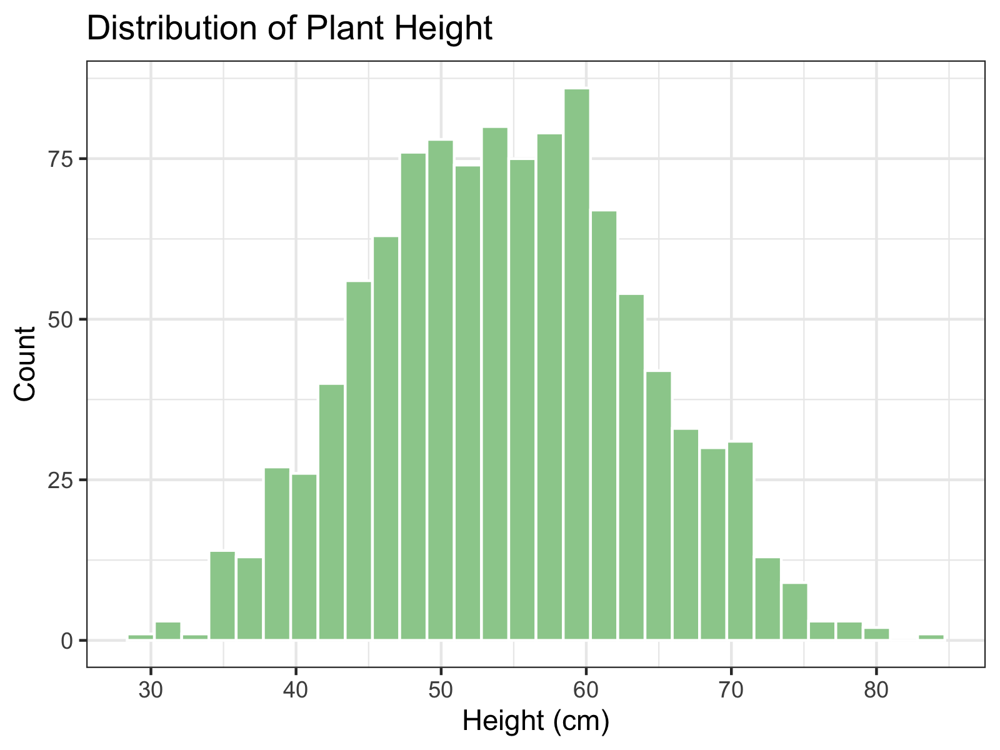  

**Figure 6.5.1A.** Histogram of plant height (`height_cm`) for all observations in the `eco_measurements` dataset. The distribution is roughly normal with moderate spread, reflecting variability across sites, habitats, and species.

---

### Stripchart (individual points)

```  
ggplot(eco, aes(x = 1, y = height_cm)) +
  geom_jitter(width = 0.15, alpha = 0.5, color = "darkgreen") +
  labs(
    title = "Individual Heights (1D Scatter)",
    x = "",
    y = "Height (cm)"
  ) +
  theme_bw() +
  theme(axis.text.x = element_blank())
```

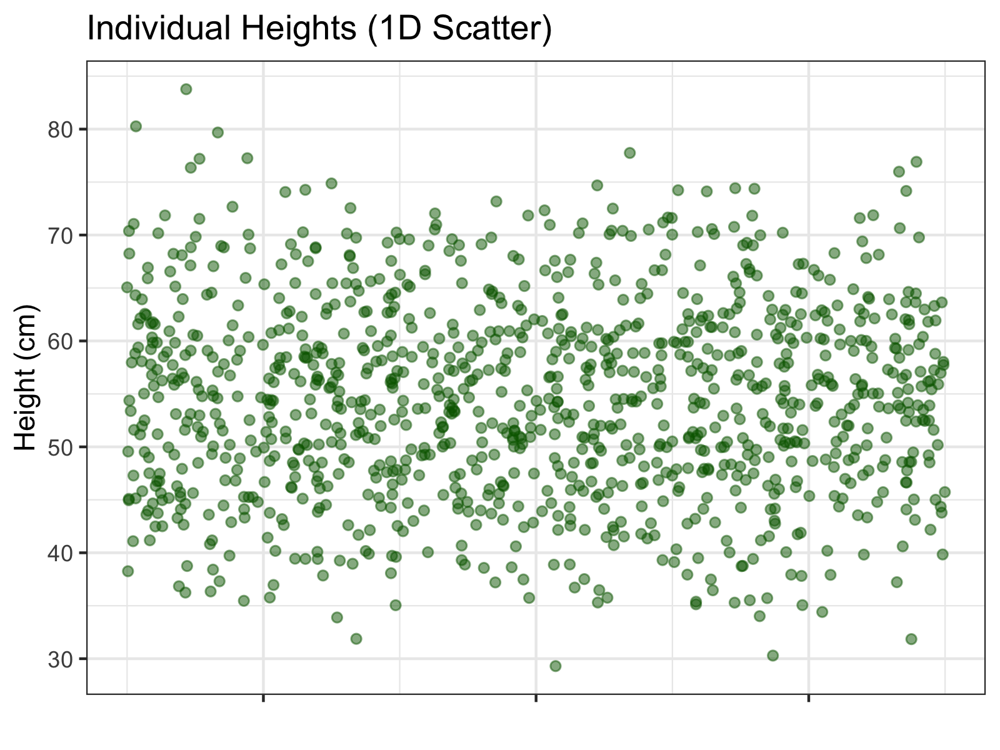  

**Figure 6.5.1B.** One-dimensional scatterplot (stripchart) of `height_cm`. Each point represents an individual plant. This view highlights outliers and local density patterns that may be less obvious in a histogram.

---

## 6.5.2 Two-dimensional scatterplot (2D)
[↑ Back to top](#effective-data-visualization-in-research)

A 2D scatterplot shows the relationship between two continuous variables.

Example: **height vs leaf area**

```  
ggplot(eco, aes(x = height_cm, y = leaf_area_cm2)) +
  geom_point(alpha = 0.7, color = "steelblue") +
  labs(
    title = "2D Scatterplot: Height vs Leaf Area",
    x = "Height (cm)",
    y = "Leaf Area (cm²)"
  ) +
  theme_bw()
```

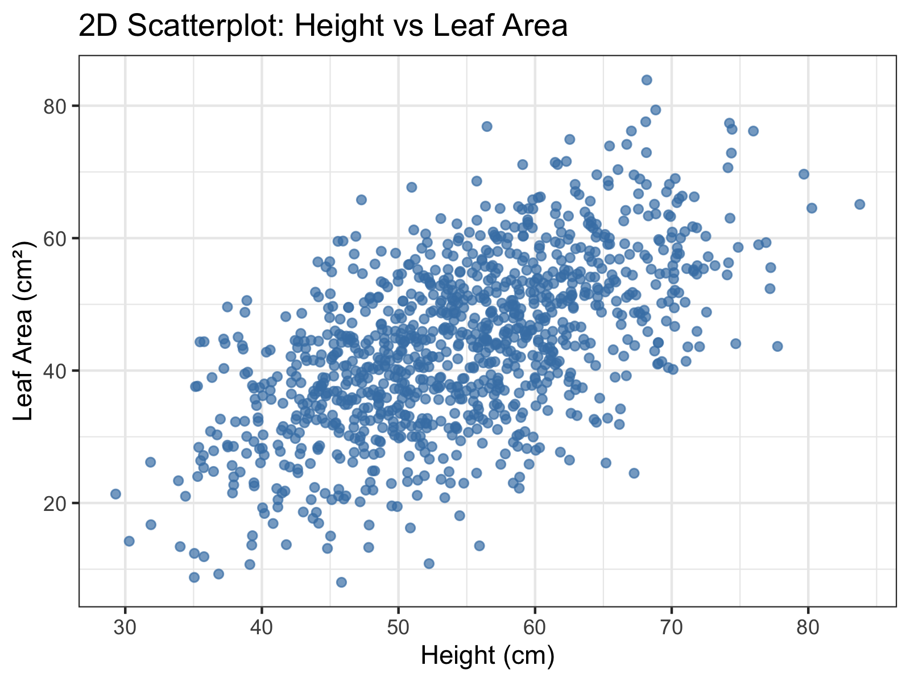  

**Figure 6.5.2.** Two-dimensional scatterplot of plant height (`height_cm`) versus leaf area (`leaf_area_cm2`). The positive trend reflects the expected relationship between size and leaf surface, with substantial biological variability.

---

## 6.5.3 Three-dimensional visualization (3D)
[↑ Back to top](#effective-data-visualization-in-research)

Three dimensions can be represented either as a true 3D plot or by encoding the third variable in color.

### 6.5.3A Interactive 3D scatterplot (Plotly)

Here the **third dimension = soil_moisture** (`soil_moisture`).  
This example is **interactive** (rotation, zoom) and is best viewed in an R session or notebook.

```  
library(plotly)

plot_ly(
  eco,
  x     = ~height_cm,
  y     = ~leaf_area_cm2,
  z     = ~soil_moisture,
  color = ~habitat_type,
  colors = c("forest" = "darkgreen",
             "grassland" = "goldenrod2",
             "wetland" = "steelblue"),
  type   = "scatter3d",
  mode   = "markers",
  marker = list(size = 3, opacity = 0.7)
)
```

For static documentation (e.g., this README), we also include a PNG snapshot of this interactive plot:

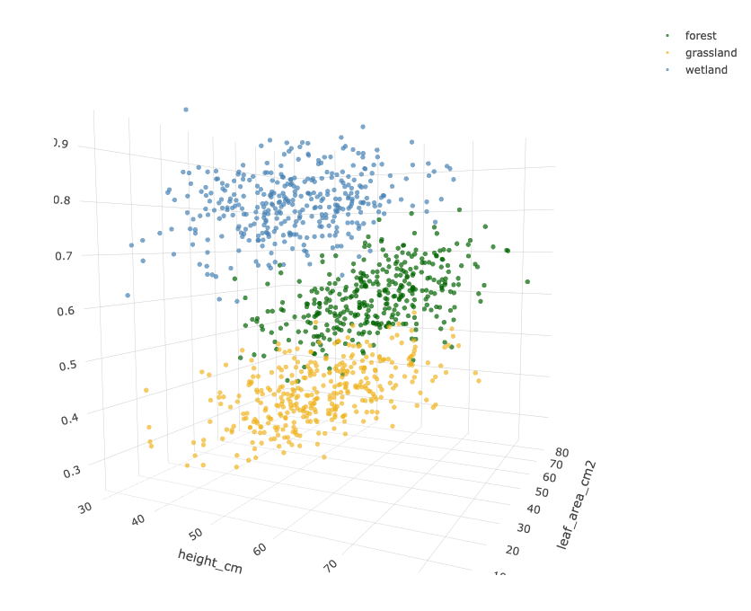  

**Figure 6.5.3A.** Snapshot of an interactive 3D Plotly scatterplot of height (`height_cm`), leaf area (`leaf_area_cm2`), and soil moisture (`soil_moisture`). Points are colored by `habitat_type`.


> Note: This Plotly figure is interactive and not exported as a PNG in this repository.
> But you can follow the istruction to save the image:
```
# 1. Print p_6_5_3_plotly3d in RStudio or browser.
# 2. Take a screenshot.
# 3. Crop the image.
# 4. Save it as:filename.png
```

---

### 6.5.3B “3D” encoded by color (pseudo-3D)

The third dimension (habitat type) is encoded using **color** instead of a z-axis coordinate.

```  
ggplot(eco, aes(
  x     = height_cm,
  y     = leaf_area_cm2,
  color = habitat_type
)) +
  geom_point(alpha = 0.7) +
  labs(
    title = "Pseudo-3D Scatterplot (Third Dimension = Color)",
    x = "Height (cm)",
    y = "Leaf Area (cm²)",
    color = "Habitat type"
  ) +
  theme_bw()
```

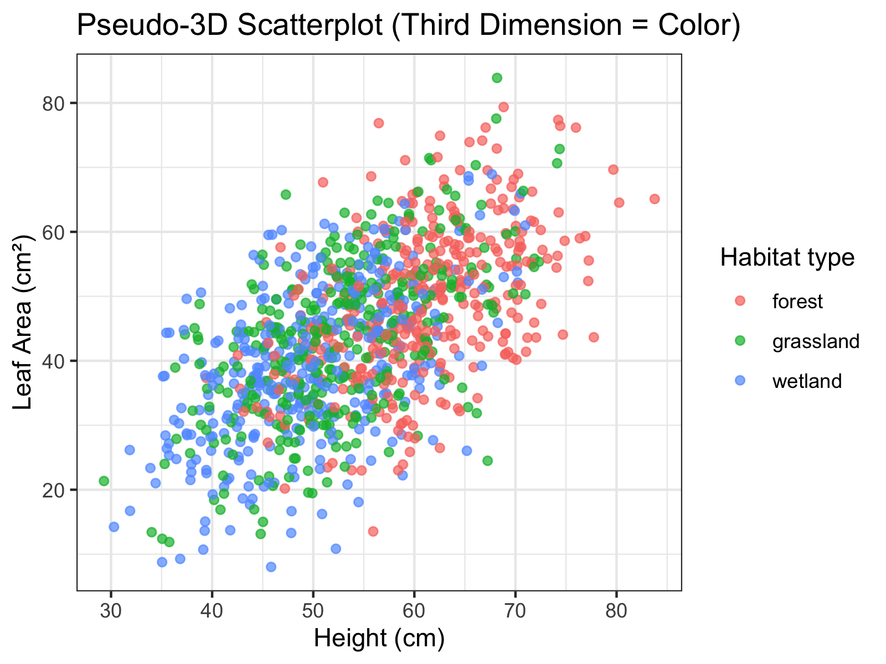  

**Figure 6.5.3.** “Pseudo-3D” scatterplot, where the third dimension is encoded as color. Height (`height_cm`) and leaf area (`leaf_area_cm2`) define the 2D plane, while `habitat_type` is mapped to point color, revealing habitat-specific clusters.

---

## 6.5.4 Four-dimensional visualization (4D)
[↑ Back to top](#effective-data-visualization-in-research)

We now add **shape** as a fourth dimension.

- x = height  
- y = leaf area  
- color = habitat type (dimension 3)  
- shape = site (dimension 4)

```  
ggplot(eco, aes(
  x     = height_cm,
  y     = leaf_area_cm2,
  color = habitat_type,
  shape = site
)) +
  geom_point(size = 2, alpha = 0.7) +
  labs(
    title = "4D Scatterplot: Adding Shape",
    x = "Height (cm)",
    y = "Leaf Area (cm²)",
    color = "Habitat type",
    shape = "Site"
  ) +
  theme_bw()
```

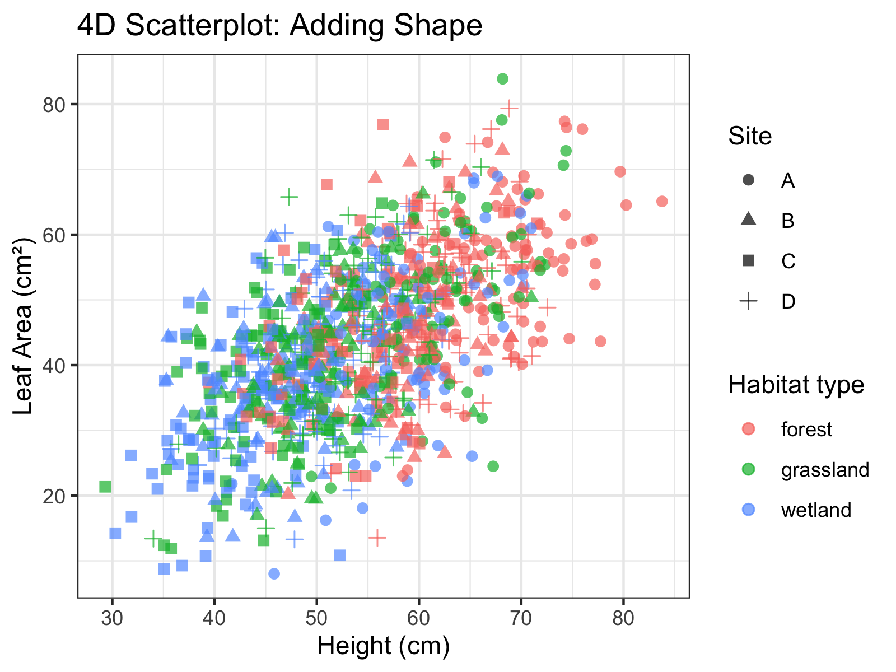  

**Figure 6.5.4.** Four-dimensional scatterplot. Height (`height_cm`) and leaf area (`leaf_area_cm2`) define the 2D space, `habitat_type` is encoded by color, and `site` is encoded by point shape. This allows simultaneous inspection of habitat and site differences in the same figure.

---

## 6.5.5 Five-dimensional visualization (5D)
[↑ Back to top](#effective-data-visualization-in-research)

We add **size** as a fifth dimension.

Using:

- x = height  
- y = leaf area  
- color = habitat type  
- shape = site  
- size = biomass (`biomass_g`)  

```  
ggplot(eco, aes(
  x     = height_cm,
  y     = leaf_area_cm2,
  color = habitat_type,
  shape = site,
  size  = biomass_g
)) +
  geom_point(alpha = 0.7) +
  labs(
    title = "5D Scatterplot: Adding Size",
    x = "Height (cm)",
    y = "Leaf Area (cm²)",
    color = "Habitat type",
    shape = "Site",
    size  = "Biomass (g)"
  ) +
  theme_bw() +
  scale_size_continuous(range = c(1.5, 6))
```

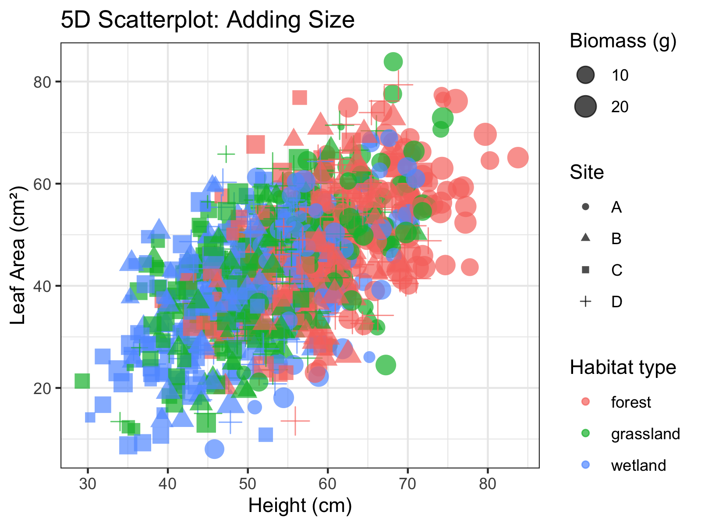  

**Figure 6.5.5.** Five-dimensional scatterplot combining position (height and leaf area), color (habitat type), shape (site), and point size (biomass in grams). This single figure encodes substantial ecological information while remaining interpretable.


At this point we have reached 5 dimensions in a single plot.  
Additional dimensions (labels and facets) will be implemented in the exercise section as an advanced task.

---
<!--
# 6.6 Exporting Publication-Ready Figures
[↑ Back to top](#effective-data-visualization-in-research)

This section demonstrates:
- exporting ggplot2 and base R figures,
- recommended dimensions for journals,
- DPI considerations,
- color spaces (RGB vs CMYK),
- TIFF with LZW compression,
- PDF for vector-based figures.

<< content to be added >>

---
-->

<!--
# 6. Data Visualization in R
[↑ Back to top](#effective-data-visualization-in-research)

## Base R Plots
[↑ Back to top](#effective-data-visualization-in-research)

<< content to be added >>

---

## ggplot2 Fundamentals
[↑ Back to top](#effective-data-visualization-in-research)

<< content to be added >>

---

## Exporting Publication-Ready Figures
[↑ Back to top](#effective-data-visualization-in-research)

<< content to be added >>

---

## Scatterplot: 2–7 Dimensions
[↑ Back to top](#effective-data-visualization-in-research)

<< content to be added >>

-->


---
<!--================================================================================================================================================================================= -->
---


# 7. Exercises
[↑ Back to top](#effective-data-visualization-in-research)

The following exercises are designed to consolidate the concepts discussed in this workshop:  
vector vs raster graphics, journal-specific figure requirements, and high-dimensional data visualization in R.

---

## Exercise 1 — Vector vs raster in a composite figure (PowerPoint / Inkscape)

**Goal:**  
Understand the visual differences between vector text/graphics and embedded raster images when zooming in.

**Tasks:**

1. Open **PowerPoint** or **Inkscape** (or a similar vector-based illustration program).
2. Create a new slide/page and:
   - Add a **text box** with a short caption (e.g., “Example scientific figure – vector text + raster plot”).
   - Insert a **raster image** (bitmap), for example one of the PNG plots generated earlier in this workshop (e.g. a ggplot PNG figure).
3. Arrange the layout so that both the text and the raster image are clearly visible.
4. Export the project to **PDF** (Portable Document Format).
5. Open the resulting PDF in a PDF viewer (e.g. Adobe Acrobat Reader, a browser, or another PDF viewer).
6. Zoom in strongly (e.g. 400–1600%) and carefully inspect:
   - the **vector text** (the text you typed in PowerPoint/Inkscape),
   - the **raster image** (the inserted bitmap plot).
7. Answer the following questions (mentally or in a short report):
   - How does the sharpness of the **vector text** change with zoom?
   - How does the appearance of the **raster image** change (e.g. pixelation, blurry edges)?
   - What are the implications of these differences for preparing **publication-quality figures** that combine text, arrows and raster plots or microscopy images?

---

## Exercise 2 — IJMS-compliant TIFF export from ggplot2

**Goal:**  
Generate a publication-ready figure in **TIFF** format that satisfies the *International Journal of Molecular Sciences (IJMS)* technical requirements, and verify its properties using IrfanView.

**Tasks:**

1. Read the **“Figures” / “Original Images”** section in the IJMS *Instructions for Authors*  
   (https://www.mdpi.com/journal/ijms/instructions), focusing on:
   - required **resolution** (e.g. ≥ 1000 px or 300 dpi),
   - acceptable **file formats** (TIFF, JPEG, EPS, PDF),
   - recommended **color space** (RGB, 8 bits per channel),
   - any comments on compression or original image data.
2. Using **R + ggplot2** and the `eco_measurements` dataset, generate a clear, well-labeled figure, for example:
   - a PCA plot,
   - a multi-dimensional scatterplot,
   - or a boxplot summarizing a biologically meaningful comparison.
3. Export this figure as a **TIFF** file using a graphical device such as:

   - resolution: **300 dpi**  
   - size: suitable for a journal figure (e.g. 150–180 mm width)  
   - compression: **LZW**  

4. Open the exported TIFF file in **IrfanView** (or a comparable image viewer) and verify:
   - image **dimensions** (in pixels and in physical units, e.g. cm or inches),
   - **resolution** (DPI),
   - **color depth** (bits per channel).
5. Using IrfanView (or similar software):
   - Adjust the **color depth** to **8 bits per channel** (if supported),
   - ensure that **LZW compression** is used when saving.
6. Compare the **file size** before and after this modification:
   - How did LZW compression and/or color depth reduction affect file size?
   - Would this optimization be beneficial (or risky) for journal submission?

---

## Exercise 3 — 9-dimensional visualization using ggplot2

**Goal:**  
Design a single 2D figure (built with ggplot2) that encodes information from **nine different variables** (columns) of the `eco_measurements` dataset as clearly and interpretably as possible.

**Tasks:**

1. Choose **two numeric variables** to define the **2D plane** (x and y axes)  
   – for example: `height_cm` (x) and `leaf_area_cm2` (y).
2. Add further dimensions step by step, reusing concepts from Section 6.5:
   - **color** (e.g. `habitat_type`),
   - **shape** (e.g. `site`),
   - **size** (e.g. `biomass_g`),
   - **point transparency** (*alpha*, e.g. to indicate measurement reliability or another numeric variable),
   - **line type** or **border style** (if overlaying model fits or confidence regions),
   - **text labels** for selected points (e.g. using `geom_text()` or `geom_label()`),
   - **facets** (e.g. `facet_wrap(~ species)` or another factor).
3. Construct a ggplot2 figure that uses a combination of these encodings so that **in total 9 variables** (columns) from `eco_measurements` are represented in a single composite graphic.
4. Reflect on:
   - Which dimensions are still easy to interpret?
   - At which point does the figure become overloaded or confusing?
   - How could you split the information into **multi-panel figures** (A, B, C, …) to improve clarity while still conveying all 9 dimensions?

*Hint:* There is no single “correct” solution. The objective is to explore the limits of multi-dimensional encoding and to think critically about **readability vs information density** in scientific visualizations.


### Solutions

# 7. Suggested Solutions
[↑ Back to top](#effective-data-visualization-in-research)

The following sections provide suggested solutions and commentary for the exercises in Section 7.

---

## Solution to Exercise 1 — Vector vs raster in a composite figure

**Key observation**

- **Vector graphics (text, shapes, vector plots)** are resolution-independent.  
  When you zoom in (e.g. 400–1600%), edges remain perfectly sharp, curves remain smooth, and text is crisp.
- **Raster graphics (bitmaps such as PNG, JPG, TIFF)** are made of pixels.  
  When zoomed in aggressively, individual pixels become visible, edges become jagged, and the image appears blurry or blocky.

**Practical conclusion**

- Whenever possible, scientific plots (especially those containing **fine details** such as labels, axes, legends, small glyphs) should be generated in a **vector format** (PDF, SVG, EPS) or embedded as vector objects in the final figure (e.g. exported from R/ggplot2 as PDF and arranged in Inkscape).
- Raster images are still necessary for:
  - microscopy,
  - gels/blots,
  - ray-traced molecular graphics (e.g. PyMOL, POV-Ray),
  - heatmaps with very high pixel density.
- Complex plots such as **Circos diagrams** or dense genomic tracks benefit strongly from vector output, because:
  - all small labels and tick marks remain readable even at high zoom,
  - the figure can be resized for different layouts (single-column, double-column, poster) without quality loss.

In practice, a **hybrid approach** is often used:

- main plot and annotations → **vector**,  
- embedded raster elements (e.g. molecular rendering, microscopy images) → **high-resolution TIFF/PNG**,  
- final assembly → **PDF** (which can contain both vector and raster layers).

---

## Solution to Exercise 2 — IJMS-compliant TIFF export from ggplot2

Below is a detailed, step-by-step example of exporting an IJMS-style figure (PCA plot) as a TIFF file and then checking it in IrfanView.

### Step 1 — Run PCA on the eco_measurements dataset

```  
# Load dataset
eco <- read.csv("files/eco_measurements.csv", stringsAsFactors = FALSE)

eco$site         <- factor(eco$site)
eco$habitat_type <- factor(eco$habitat_type)

# Select numeric columns for PCA
num_cols    <- sapply(eco, is.numeric)
eco_numeric <- eco[, num_cols]

# PCA with centering and scaling
pca <- prcomp(eco_numeric, center = TRUE, scale. = TRUE)

# Variance explained by each PC
var_exp <- (pca$sdev^2) / sum(pca$sdev^2)
pc1_var <- round(var_exp[1] * 100, 1)
pc2_var <- round(var_exp[2] * 100, 1)

# Combine PCA scores with grouping variables
pca_scores <- as.data.frame(pca$x)
pca_scores$habitat_type <- eco$habitat_type
pca_scores$site         <- eco$site
```

### Step 2 — Create a clear PCA visualization with ggplot2

```  
library(ggplot2)

p_pca <- ggplot(
  pca_scores,
  aes(x = PC1, y = PC2,
      color = habitat_type,
      shape = site)
) +
  geom_point(alpha = 0.7, size = 2) +
  labs(
    title = "PCA of eco_measurements dataset",
    x = paste0("PC1 (", pc1_var, "%)"),
    y = paste0("PC2 (", pc2_var, "%)"),
    color = "Habitat type",
    shape = "Site"
  ) +
  theme_bw(base_size = 12) +
  theme(
    plot.title      = element_text(hjust = 0.5),
    legend.position = "right",
    panel.grid      = element_line(linewidth = 0.2)
  )

# Optional on-screen preview:
# print(p_pca)
```

### Step 3 — Export as TIFF with IJMS-style parameters

According to IJMS guidelines, figures should be at least **300 dpi** and **≥ 1000 px** in each dimension, in **RGB (8 bits per channel)**, preferably **TIFF, JPEG, EPS, or PDF**.

Below we export a square figure of **180 mm × 180 mm at 300 dpi**, using **LZW compression**:

```  
tiff(
  filename    = "files/fig_IJMS_PCA_eco.tiff",
  width       = 180,     # width in millimetres
  height      = 180,     # height in millimetres
  units       = "mm",
  res         = 300,     # 300 dpi
  compression = "lzw"    # lossless compression
)

print(p_pca)

dev.off()
```

**What this does:**

- `units = "mm"` and `width/height = 180` → physical size appropriate for many journal figures.  
- `res = 300` → 300 dpi (dots per inch), standard for high-quality publication figures.  
- `compression = "lzw"` → lossless compression, commonly accepted by journals.

### Step 4 — Verify the file in IrfanView

1. Open `fig_IJMS_PCA_eco.tiff` in **IrfanView**.
2. Check:
   - **Image properties** (Image → Information…):
     - resolution (should show 300 dpi),
     - dimensions (in pixels and cm),
     - color depth (typically 24-bit RGB = 8 bits per channel).
3. If required by the journal or for file size optimization:
   - Convert color depth to **8 bits per channel** (e.g. using Image → Decrease Color Depth… or a similar function).
   - Make sure to keep **LZW compression** enabled when saving.
4. Compare **file sizes**:
   - Before modification (original export from R),
   - After color depth reduction and LZW compression.
   - Discuss whether size reduction is significant and whether there is any visible impact on figure quality.

---

## Solution to Exercise 3 — 9-dimensional visualization using ggplot2

We want to construct a 2D plot that encodes information from **nine different variables** in the `eco_measurements` dataset.

A possible mapping (based on the idea: x, y, color, shape, size, shade, labels, multi-panel) is:

1. **Dimension 1** – x-axis:          `height_cm`  
2. **Dimension 2** – y-axis:          `leaf_area_cm2`  
3. **Dimension 3** – color (hue):     `habitat_type`  
4. **Dimension 4** – shape:           `site`  
5. **Dimension 5** – point size:      `biomass_g`  
6. **Dimension 6** – color shade / transparency (`alpha`): a numeric variable such as `soil_moisture`  
7. **Dimension 7** – faceting within one figure: `species` (small multiples)  
8. **Dimension 8** – text labels for selected points: e.g. points with highest `growth_rate_cm_week`  
9. **Dimension 9** – multi-panel figure A/B: two complementary views combined into one composite figure (e.g. full range vs zoomed-in region)

Poniżej przykładowa implementacja takiej „9D” koncepcji.

### Step 1 — Prepare a subset of points to label

We will label a small number of biologically “interesting” points, e.g. those with highest growth rate.

```  
library(dplyr)

# Select a subset of points to label (e.g. top 15 by growth rate)
label_df <- eco %>%
  arrange(desc(growth_rate_cm_week)) %>%
  slice(1:15)
```

### Step 2 — Build the main 5D+2D (facets + labels) ggplot

- x = `height_cm`  
- y = `leaf_area_cm2`  
- color = `habitat_type`  
- shape = `site`  
- size = `biomass_g`  
- alpha = scaled `soil_moisture`  
- facets = `species`  
- labels = subset of points (`label_df`)

For labels we can use either `geom_text()` or, for nicer placement, `ggrepel` (optional).

```  
# Optional: if you want nicer labels without overlap
# install.packages("ggrepel")
library(ggrepel)

p_9D_main <- ggplot(
  eco,
  aes(
    x     = height_cm,
    y     = leaf_area_cm2,
    color = habitat_type,
    shape = site,
    size  = biomass_g,
    alpha = soil_moisture
  )
) +
  geom_point() +
  # Facet by species (Dimension 7)
  facet_wrap(~ species) +
  # Add labels for selected points (Dimension 8)
  geom_text_repel(
    data = label_df,
    aes(
      x     = height_cm,
      y     = leaf_area_cm2,
      label = paste0("ID_", row_number())
    ),
    size        = 3,
    color       = "black",
    min.segment.length = 0,
    max.overlaps       = 50,
    inherit.aes        = FALSE
  ) +
  scale_size_continuous(range = c(1.5, 5)) +
  scale_alpha_continuous(range = c(0.4, 1.0)) +
  labs(
    title = "High-dimensional ecological visualization (main view)",
    x = "Height (cm)",
    y = "Leaf Area (cm²)",
    color = "Habitat type",
    shape = "Site",
    size  = "Biomass (g)",
    alpha = "Soil moisture"
  ) +
  theme_bw(base_size = 11) +
  theme(
    plot.title      = element_text(hjust = 0.5),
    legend.position = "right"
  )
```

This single ggplot already encodes:

1. x (height)  
2. y (leaf area)  
3. color (habitat type)  
4. shape (site)  
5. size (biomass)  
6. alpha / shade (soil moisture)  
7. facets (species)  
8. labels (selected high-growth points)  

### Step 3 — Add Dimension 9: multi-panel composite figure (A and B)

We can define a **zoomed-in view** as a second plot and combine both into a multi-panel figure (A: full range, B: zoomed-in region). This adds a ninth dimension: **panel identity / context**.

```  
# Create a zoomed-in version of the same plot (e.g. focusing on moderate heights)
p_9D_zoom <- p_9D_main +
  coord_cartesian(xlim = c(40, 80), ylim = c(50, 250)) +
  labs(title = "High-dimensional ecological visualization (zoomed view)")

# Combine plots into a composite figure A | B
# install.packages("patchwork")  # if not installed
library(patchwork)

p_9D_combined <- p_9D_main + p_9D_zoom +
  plot_annotation(tag_levels = "A")   # Automatically labels panels A, B
```

Now `p_9D_combined` is a **multi-panel figure (A and B)** that:

- encodes **8 visual dimensions** inside each panel, and  
- adds a **9th “dimension”** by providing two complementary views (global vs zoomed) within a single composite figure.

### Summary

This solution is **only one possible implementation**. The key ideas are:

- Use **position (x, y)** for the most important numeric variables.  
- Use **color, shape, size, alpha** for additional dimensions.  
- Use **facets** to split high-level categories into separate panels.  
- Use **labels** sparingly for the most important points.  
- Use **multi-panel figures (A, B, C, …)** to split complexity into more interpretable views.  

The pedagogical goal is not to force all nine dimensions into a single overcomplicated plot, but to show how far we can go before readability suffers—and how multi-panel figures can help maintain clarity.


---

# Acknowledgements

Workshop developed by  
**dr Jan Paweł Jastrzębski** 
[bioinformatyka@gmail.com](mailto:bioinformatyka@gmail.com)
ORCID ID: [0000-0001-8699-7742](https://orcid.org/0000-0001-8699-7742)
University of Warmia and Mazury in Olsztyn

